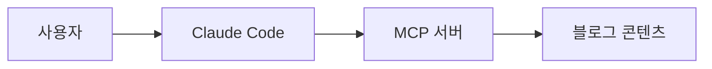

# /write-post — Post Compiler Pipeline

토픽이나 아이디어를 받아 리서치 → brief → 초안 → 검수 → 발행까지 원스톱으로 실행하는 콘텐츠 파이프라인.

입력: $ARGUMENTS

## 사전 조건

- 이 skill을 실행하기 전에 DESIGN.md를 읽어서 블로그의 디자인 시스템을 이해하세요.
- `scripts/write-post/types.ts`를 읽어서 Brief, Review, RunManifest 스키마를 이해하세요.

## 파라미터 파싱

입력에서 다음을 추출하세요:
- **topic**: 글감 (필수, 첫 번째 인자 또는 따옴표 안의 문자열)
- **--category**: essay|tutorial|build-log|research|note (기본: essay)
- **--series**: 시리즈 이름 (선택)
- **--order**: 시리즈 순서 (선택)
- **--resume**: 기존 run ID로 재개 (선택)
- **--continue-from**: 기존 글 slug 기반 후속 글 (선택)

## Step 0: Run 초기화

1. `--resume`가 있으면 `scripts/write-post/run.ts`의 `loadRun()`으로 기존 run 로드. 마지막 완료된 phase 다음부터 재개.
2. 새 실행이면 `createRun(topic)`으로 `.pipeline/runs/<date>-<slug>/` 생성.
3. `run.json`의 status를 확인하고 해당 phase부터 시작.

```typescript
// Bash로 실행:
// bun -e "const {createRun} = require('./scripts/write-post/run.ts'); const r = createRun('토픽'); console.log(JSON.stringify(r))"
```

## Step 1: Context Assembly (Phase 1 — researching)

`updateRun(runDir, { status: 'researching', phase: 1 })`

1. **MCP로 기존 글 탐색**: `search_posts` MCP 도구로 topic과 관련된 기존 글을 검색. 결과를 `mcp-hits.json`에 저장.
2. **외부 리서치**: WebSearch로 topic 관련 최신 자료를 조사. 불가능하면 MCP 컨텍스트만으로 진행.
3. **`--continue-from`**: 지정된 slug의 글을 `get_post`로 읽고, 후속 글로 연결 포인트 파악.
4. 모든 리서치 결과를 `research.md`에 마크다운으로 정리하여 `writeArtifact(runDir, 'research.md', content)`.

## Step 2: Brief Generation (Phase 2 — briefing)

`updateRun(runDir, { status: 'briefing', phase: 2 })`

리서치 결과를 바탕으로 `brief.json`을 생성 (Brief 스키마 준수):

1. **angles**: 최소 3개의 각도 제시. 각 각도에 noveltyScore (0-100) 부여.
   - 기존 글과 중복되는 내용이 많으면 낮은 점수
   - 완전히 새로운 영역이면 높은 점수
2. **audience**: 타겟 독자 정의
3. **keyClaims**: 글의 핵심 주장 3-5개
4. **references**: 참조한 기존 글 (mcp-hits에서)
5. **concepts**: 이 글에서 다룰 개념들 (frontmatter concepts 필드용)
6. **titleOptions**: 제목 옵션 3-5개

`writeArtifact(runDir, 'brief.json', JSON.stringify(brief, null, 2))`

### 사람 승인 (필수)

AskUserQuestion으로 사용자에게 brief를 보여주고:
- 어떤 **각도**로 갈지 선택
- 어떤 **제목**으로 갈지 선택
- 추가 지시사항이 있는지 확인

선택 결과를 brief.json의 `selectedAngle`, `selectedTitle`에 업데이트.

## Step 3: Draft + Review (Phase 3 — drafting → reviewing)

### 3a: 초안 작성 (drafting)

`updateRun(runDir, { status: 'drafting', phase: 3 })`

선택된 각도와 제목으로 마크다운 초안 작성. **반드시 아래의 글쓰기 제약조건을 따르세요.**

#### 글쓰기 제약조건

**목표 레지스터**: 친근한 전문성 (intimate expertise) — 컨퍼런스 발표가 아닌, 시니어 동료가 커피 마시면서 설명하는 톤.

**Voice Anchor** (이 스타일로 작성):
> "처음엔 이게 좋은 아이디어인 줄 알았다. 3주 후에 후회했다."
> "솔직히 말하면, 아직도 이 부분은 잘 모르겠다."
> "숫자로 보면 명확하다: 배포 시간이 14분에서 2분으로 줄었다."

**금지 표현 (발견 시 즉시 수정)**:
- "최근 ~가 중요해지고 있습니다" — 이걸로 시작하면 안 됨
- "이 글에서는 ~을 살펴보겠습니다" — 글이 뭘 하는지 선언하지 않음
- "다음과 같습니다:" 바로 뒤에 불릿 리스트 — 문장으로 풀어서
- "첫째, 둘째, 셋째" 나열 — "먼저... 그리고... 마지막으로는..."
- "결론적으로" / "이 글에서 살펴본 바와 같이" — 절대 금지
- "물론, 경우에 따라 다를 수 있지만" — 헤지 제거
- "~함으로써 가능합니다" → "~하면 됩니다"
- "~을 활용하여" → "~을 써서" / "~로"
- "~하는 것이 중요합니다" → "~안 하면 나중에 후회합니다" 또는 구체적 이유
- "고려해야 할 사항이 있습니다" → "함정이 하나 있어요"
- "이를 통해 알 수 있습니다" → "이래서 그런 거였다"
- "다양한 방법들이 있습니다" — 하나를 골라서 추천

**구조 규칙**:
- 인접한 두 섹션의 단어 수가 20% 이내로 같으면 안 됨 (길이 변화 필수)
- 최소 한 곳에서 모순 전환 사용: "그런데 실제로는...", "근데 해보니까 달랐다"
- 주요 섹션마다 구체적인 숫자, 날짜, 또는 측정값 최소 1개
- 연속 불릿 리스트 2개 이하 (불릿 남용 금지)
- ~아/어요 또는 ~ㄴ다 어미 혼용 (합니다체만 쓰지 않음)
- 매 주요 섹션에 한 번은 불확실성/솔직한 인정 포함

**인용/출처 규칙 (필수)**:
- 외부 데이터, 통계, 연구 결과, 사례를 인용할 때 GFM 각주 사용: 본문에 `[^1]`, 하단에 `[^1]: [출처명](URL)`
- 나무위키/위키피디아 스타일: 본문에 작은 위첨자 번호, 클릭하면 하단 각주로 이동
- 각주는 글 맨 마지막에 모아서 정의: `[^1]: [출처명 — 제목](URL)`
- 날짜/시기를 언급할 때는 반드시 팩트체크 후 구체적 연도 사용 ("3~4년 전" 같은 모호한 표현 금지)
- 리서치 단계(Step 1)에서 출처 URL을 반드시 수집해둘 것

**도입부 패턴 (4가지 중 하나 선택)**:
1. 구체적 장면/순간: "배포 직전 30분, 슬랙에 경고가 떴다."
2. 도발적 주장: "사실 MCP는 과대평가됐다. 적어도 대부분의 팀에게는."
3. 불편한 질문: "AI 에이전트한테 코드 리뷰를 맡겨본 적 있나요?"
4. 독자가 이미 겪고 있는 상태: "배포가 무섭다. 아직도. 5년이 지났는데도."

**마무리 패턴 (3가지 중 하나 선택, 요약 절대 금지)**:
1. 열린 질문/도발: "에이전트가 코드를 다 짜주면, 개발자는 뭘 할까요?"
2. 구체적 다음 행동: "오늘 당장 해볼 수 있는 건 하나입니다."
3. 솔직한 불완전함 인정: "아직 완전히 풀린 건 아닙니다."

**한국어 문장부호**:
- 쉼표는 자연스러운 호흡 위치에만. 접속 어미 뒤마다 쉼표 넣지 않음 (AI 최대 적신호)
- 삽입구에는 쉼표 대신 em-dash (—) 사용
- 말줄임표 (...)는 진짜 불확실할 때만, 장식용 금지

#### 섹션별 생성 (Voice Summary 핸드오프)

2,000단어 이상의 글은 한 번에 쓰지 않음. 섹션별로 나눠서 생성:

1. 도입부 + 첫 섹션 작성
2. Voice Summary 생성 (톤, 문장 리듬, 어미 패턴, 사용된 구체적 숫자)
3. Voice Summary + 이전 섹션의 마지막 문단을 참고하여 다음 섹션 작성
4. 반복
5. 도입부와 마무리는 본문 완성 후 최종 수정

#### 이미지 전략

글에 시각 요소를 포함하세요:

**Mermaid 다이어그램** (아키텍처, 플로우, 관계도):
- 마크다운에 ```mermaid 코드블록으로 직접 작성
- 글당 1-2개. 복잡한 개념을 설명할 때 텍스트 대신 사용
- 다이어그램 전후에 설명 텍스트 필수 (다이어그램만 던지지 않음)



**Hero 이미지 프롬프트**:
- frontmatter에 `heroImagePrompt` 필드 추가 (영문, 이미지 생성 AI용)
- 글의 핵심 개념을 추상적/시각적으로 표현하는 프롬프트
- 예: "Minimalist isometric illustration of interconnected knowledge nodes forming a growing network, blue and white palette, clean technical aesthetic"

**이미지 배치 리듬**: hero → ~300단어 텍스트 → 첫 다이어그램 → ~400단어 → 두번째 다이어그램 → 마무리

#### Frontmatter

```yaml
---
title: '선택된 제목'
description: '사람 + AI 에이전트 모두가 참조하는 명확한 설명'
summary: '1-2문장 핵심 요약'
pubDate: 'YYYY-MM-DD'
category: 'category'
tags: ['tag1', 'tag2']
series: '시리즈명'          # 해당 시
seriesOrder: N              # 해당 시
toolsUsed: ['Claude Code', 'Post Compiler']
heroImagePrompt: '영문 이미지 생성 프롬프트'
draft: true
concepts:
  - name: 'Concept Name'
    related: ['related1', 'related2']
---
```

`writeArtifact(runDir, 'draft-v1.md', content)`

### 3b: AI Slop 검수 (reviewing)

`updateRun(runDir, { status: 'reviewing' })`

초안을 검수하여 `review.json` 생성 (Review 스키마 준수).

**한국어 번역체 검출 (최우선)**:
1. 쉼표 과다 — 문장의 60% 이상에 쉼표가 있으면 번역체 의심
2. "~함으로써", "~을 통해", "~을 활용하여" 패턴
3. "~하는 것이 중요합니다", "고려해야 할 사항" 패턴
4. Sino-Korean 명사화 남용 (활용화, 최적화, 구조화, 효율화 → 쓰다/만들다/고치다로)
5. 수식어 적층 명사구 (4단어 이상 명사 앞 수식어 → 별도 절로 분리)

**구조적 AI 패턴 검출**:
6. 균등한 섹션 길이 — 인접 섹션이 20% 이내 같은 길이면 경고
7. "이 글에서는 ~을 살펴보겠습니다" 식 도입부
8. "결론적으로" / "요약하면" 식 마무리
9. 반복 문장 구조 (연속 3개 이상 같은 패턴)
10. 모든 주장에 "물론 경우에 따라" 헤지 부착

**일반 AI Slop**:
11. AI 상투어 ("delve", "crucial", "robust", "comprehensive", "landscape", "tapestry")
12. 일반적 찬사/과장 ("groundbreaking", "revolutionary", "game-changing")
13. 이모지 남용

**noveltyScore**: 기존 글과 얼마나 다른 내용인지 (0-100)
**reproducibilityScore**: 독자가 단계를 따라할 수 있는지 (0-100, tutorial/build-log에 특히 중요)
**verdict**: pass, revise, reject

revise면 수정 후 `draft-v2.md` 생성하고 재검수. reject면 사용자에게 알리고 중단.

`writeArtifact(runDir, 'review.json', JSON.stringify(review, null, 2))`

### 사람 최종 승인 (필수)

최종 초안과 review 결과를 사용자에게 보여주고 승인 요청.
수정 요청이 있으면 반영 후 새 draft 버전 생성.

## Step 4: Compile + Publish (Phase 4 — compiling)

`updateRun(runDir, { status: 'compiling', phase: 4 })`

### 4a: 글 발행

최종 초안의 frontmatter에서 영문 slug를 결정하고:

```bash
bun run scripts/new-post.ts "제목" --slug <slug> --category <category> --tags "tag1,tag2" --series "시리즈" --order N --tools "Claude Code,Post Compiler"
```

생성된 파일에 최종 초안 내용을 Write. draft: true로 유지 (사용자가 원하면 false로 변경).

### 4b: 빌드로그 생성

`updateRun(runDir, { slug: '<발행된-slug>' })`

```bash
bun run scripts/write-post/compile-build-log.ts <runDir>
```

### 4c: 콘텐츠 인덱스 리빌드

```bash
bun run scripts/build-content-index.ts
```

### 4d: 다음 글 추천

topic, 기존 글, concepts를 바탕으로 3개의 다음 글감을 추천:
- 각 추천에 대해 topic, reason, suggestedCategory, relatedConcepts 포함
- `writeArtifact(runDir, 'recommendations.json', JSON.stringify(recs, null, 2))`

### 4e: 완료

`updateRun(runDir, { status: 'completed' })`

사용자에게 최종 요약 출력:
- 발행된 글 경로
- 빌드로그 경로
- 다음 글 추천 3개
- `bun run dev`로 프리뷰 안내

## 중단/재개

세션이 끊기거나 실패하면:
1. `run.json`의 status와 phase를 확인
2. `/write-post --resume <run-id>`로 재개
3. 이미 생성된 artifact (brief.json, research.md 등)는 보존됨
4. 마지막 성공 phase 다음부터 재실행

## 주의사항

- **절대 사람 승인 없이 글을 발행하지 마세요.** Step 2와 Step 3에서 반드시 AskUserQuestion 사용.
- 한국어로 글을 작성하되, slug와 태그는 영문으로.
- description과 summary는 AI 에이전트가 참조하므로 명확하고 정보적으로.
- 기존 글의 톤과 스타일을 반드시 참고 (src/content/blog/ 읽기).
