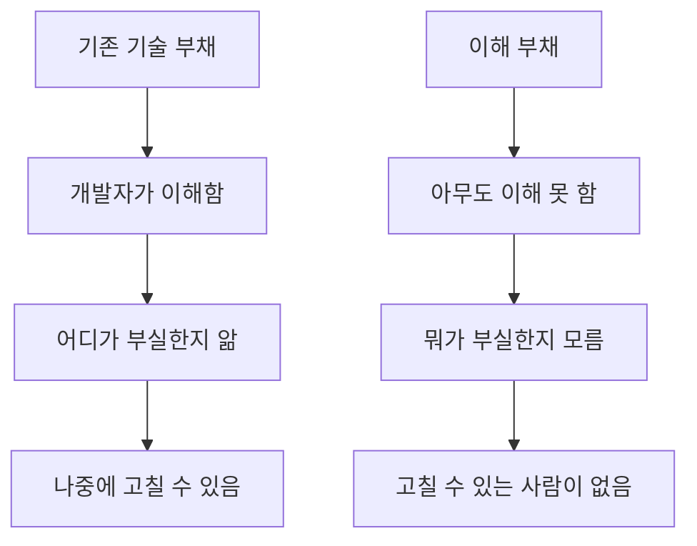

## 만드는 속도는 빨라졌다. 이해하는 속도는 그대로다.

AI로 코드를 쓰면 빠르다. 진짜로 빠르다. 함수 하나, 컴포넌트 하나, API 엔드포인트 하나 — 프롬프트 한 줄이면 나온다. 하루에 수천 줄이 커밋된다.

근데 그 코드를 읽는 속도는 안 빨라졌다. 사람의 읽기 속도는 AI가 등장하기 전이나 지금이나 같다. 코드 한 줄을 이해하는 데 걸리는 시간, 함수의 의도를 파악하는 데 걸리는 시간, 이 모듈이 저 모듈과 어떻게 연결되는지 머릿속에 그려보는 시간 — 그건 전혀 줄지 않았다.

쓰기와 읽기의 속도 격차가 벌어지면 어떤 일이 벌어질까? 1편에서 "만드는 것보다 살리는 것이 더 비싸다"고 썼다. 그게 어떤 모양으로 현실이 되고 있는지를 데이터로 들여다본다.

## 25% 빨라진 것 같은데 실은 19% 느려졌다

Stack Overflow의 2025년 개발자 서베이에서 개발자 84%가 AI 도구를 쓰고 있다고 답했다. 체감 생산성은 25% 향상.[^1] 근데 같은 서베이에서 AI 도구에 대한 신뢰도는 29%로, 전년 대비 11%포인트 하락했다.

빨라진 것 같은데 신뢰는 떨어졌다. 이 모순이 이상하지 않나?

이유를 보여주는 연구가 있다. 2026년 초 발표된 대규모 실증 연구에서 AI 도구를 쓰는 개발자는 개별 태스크를 21% 더 많이 완료했지만, end-to-end 작업 시간은 오히려 19% 느려졌다.[^2] 개별 함수나 버그 수정은 빨라졌는데, 전체 작업을 마무리하는 데는 더 오래 걸렸다는 뜻이다.

왜? AI가 만든 코드를 리뷰하고, 이해하고, 통합하는 시간이 추가됐기 때문이다. PR당 이슈 수를 보면 명확하다 — AI 생성 코드는 PR당 평균 10.83건, 인간이 쓴 코드는 6.45건. 1.7배.[^2]

빠르게 만들고 천천히 고치는 구조. 이게 누적되면?

## 이해 부채 — 기술 부채의 새로운 종

기술 부채(technical debt)라는 개념은 개발자라면 다 안다. 나중에 고쳐야 할 걸 알면서 지금 빠른 길을 택하는 것. 의식적인 선택이다.

AI가 만드는 부채는 성격이 다르다. 이걸 **이해 부채(comprehension debt)**라고 부르는 사람들이 있다.[^3]

기존 기술 부채는 "이건 나중에 고쳐야 하는 걸 안다"는 전제가 있다. 개발자가 코드를 이해하고 있고, 어디가 부실한지 알고, 언젠가 돌아와서 고칠 수 있다. 이해 부채는 다르다. AI가 복잡한 로직을 생성했는데 팀의 누구도 그 코드를 제대로 이해하지 못한다. 고쳐야 하는지조차 모른다. "나중에 고치자"가 아니라 "이게 뭔지 모르겠다"인 상태.

이 코드는 커밋된 순간 레거시가 된다. 레거시 코드의 정의가 뭔가? 팀에서 아무도 소유하지 않는, 건드리기 두려운 코드다. AI가 만든 코드가 정확히 그 상태로 태어난다.

GitClear가 2020년부터 2024년까지 2억 1,100만 줄의 코드를 추적한 결과가 이걸 숫자로 보여준다.[^4] 리팩토링 비율이 25%에서 10% 이하로 붕괴했다. 역사상 처음이다. 코드를 복사-붙여넣기하는 비율은 4배 증가했고, 작성 후 2주 이내에 폐기되는 코드 비율은 5.5%에서 7.9%로 올랐다.

개발자들이 코드를 이해하고 개선하는 대신 새로 만들고 버리는 패턴으로 바뀌고 있다는 뜻이다.

## 18개월 벽

이해 부채가 쌓이면 어느 시점에 한꺼번에 터진다. 그 패턴이 놀라울 정도로 예측 가능하다.[^5]

**1-3개월**: 행복 구간. 바이브코딩의 황금기. 프로토타입이 하루 만에 나오고 기능이 빠르게 쌓인다. "AI 없이 어떻게 코딩했지?" 하는 시기.

**4-9개월**: 정체. 새 기능을 추가하려면 기존 코드를 건드려야 하는데, 그 코드를 아무도 제대로 이해하지 못한다. 통합 문제가 생기기 시작한다. AI에게 "이 버그 고쳐"를 시키면 다른 데가 깨진다.

**10-15개월**: 하강. 새 기능 하나를 넣으려면 AI가 만든 레거시 코드를 디버깅하는 데 더 많은 시간이 든다. 생산성 그래프가 역전된다.

**16-18개월**: 벽. 개발 주기가 멈춘다. 팀이 자신들의 시스템을 더 이상 이해하지 못한다.

MSR 2026 학회에 발표된 연구가 이 패턴의 초기 단계를 실증했다.[^6] 에이전트 도구를 도입한 프로젝트에서 static analysis warnings가 18% 증가했고, cognitive complexity가 39% 올랐다. 연구팀은 이걸 "agent-induced complexity debt"라고 불렀다.

흥미로운 건 에이전트를 처음 도입한 repo에서만 대폭 생산성 향상(커밋 +36.3%, 추가 줄 +76.6%)이 관찰됐다는 점이다. IDE 기반 AI를 이미 쓰고 있던 repo에서는 에이전트 추가 효과가 거의 없었다(커밋 +3.1%, 추가 줄 -6.3%). 기존 AI 코드 위에 에이전트 코드가 쌓이면서 복잡도만 올라간 것으로 해석할 수 있다.

## 부채를 만드는 속도, 고칠 사람이 사라지는 속도

2026년 기준으로 AI로 프로덕션 앱을 만든 스타트업 중 8,000개 이상이 전체 또는 부분 리빌드가 필요한 상태라는 추정이 있다.[^5] 건당 $50K에서 $500K. Forrester는 기업의 75%가 중간에서 심각한 수준의 기술 부채에 직면할 거라 예측했다.[^7]

근데 진짜 무서운 건 리빌드 비용이 아니다. 리빌드를 할 수 있는 사람이 사라지고 있다는 거다.

기술 부채를 고치려면 코드를 깊이 읽고, 의도를 추론하고, 더 나은 구조를 떠올리고, 안전하게 리팩토링할 수 있는 판단력이 필요하다. 이 판단력은 주니어 개발자가 수년간 실수하고, 코드리뷰를 받고, 레거시 코드와 씨름하면서 쌓는 것이다. 근데 지금 기업들은 AI가 주니어의 일을 대체할 수 있다고 보고 주니어 채용을 줄이고 있다.[^3]

오늘 만들어지는 AI 기술 부채를 5년 후에 고칠 시니어 개발자가, 오늘 채용되지 않는 주니어 개발자다. AI가 부채를 만드는 속도는 빨라지고, 부채를 고칠 인력 파이프라인은 줄어들고, 그 사이에 시스템은 아무도 이해하지 못하는 상태로 굳어간다.

솔직히 이 부분은 아직 답이 없다. "AI가 만든 부채를 AI가 고치면 되지 않느냐"는 반론이 있고, 어느 정도는 맞다. 근데 AI가 코드를 고치려면 누군가 "뭘 고쳐야 하는지"를 알려줘야 한다. 그 "누군가"가 코드를 이해하지 못하면 시작이 안 된다.

## 만드는 기술이 아니라 살리는 구조

에이전트 시대의 개발환경에 부족한 건 만드는 속도를 올리는 기술이 아니다. 이미 넘친다. 부족한 건 **만든 것을 살리는 구조**다.

에이전트가 어디서 뭘 바꿨는지 되돌릴 수 있는 체크포인트. 이해 부채가 어디에 쌓이고 있는지 측정하는 도구. 코드의 소유자가 사람인지 AI인지 구분되는 기록 — 2편에서 다룬 Agent Trace가 그 시작이다. 그리고 리팩토링이 새 기능보다 보상받는 문화.

이 중 어느 것도 "더 좋은 AI 모델"이 나오면 해결되는 문제가 아니다. 모델이 좋아지면 코드 생성 속도는 더 빨라지고, 쓰기와 읽기의 격차는 더 벌어진다.

Stack Overflow가 2026년 1월에 올린 글의 제목이 머릿속에 남는다 — "AI can 10x developers...in creating tech debt."[^1]

에이전트가 코드를 다 짜주는 시대는 왔다. 그 코드를 18개월 후에도 읽을 수 있는 사람이 있을지 — 그건 아직 아무도 모른다.

[^1]: [Stack Overflow — AI can 10x developers...in creating tech debt](https://stackoverflow.blog/2026/01/23/ai-can-10x-developers-in-creating-tech-debt/)
[^2]: [LeadDev — How AI generated code accelerates technical debt](https://leaddev.com/technical-direction/how-ai-generated-code-accelerates-technical-debt)
[^3]: [Codepanion — Vibe Coding and Technical Debt: The Hidden Costs](https://www.codepanion.dev/blog/vibe-coding-technical-debt-ai-generated-code-2026)
[^4]: [GitClear — AI Copilot Code Quality: 2025 Data Suggests 4x Growth in Code Clones](https://www.gitclear.com/ai_assistant_code_quality_2025_research)
[^5]: [Pixelmojo — The AI Coding Technical Debt Crisis: What 2026-2027 Holds](https://www.pixelmojo.io/blogs/vibe-coding-technical-debt-crisis-2026-2027)
[^6]: [MSR 2026 — AI IDEs or Autonomous Agents? Measuring the Impact of Coding Agents](https://arxiv.org/html/2601.13597v2)
[^7]: [Salesforce Ben — 2026 Predictions: The Year of Technical Debt](https://www.salesforceben.com/2026-predictions-its-the-year-of-technical-debt-thanks-to-vibe-coding/)
