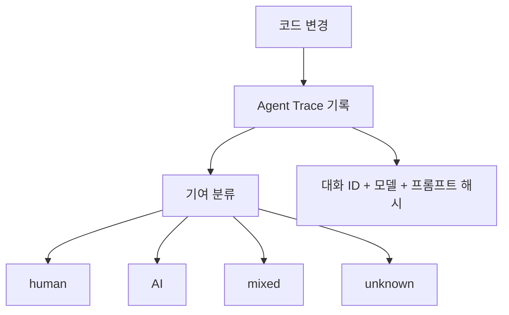

## `git blame`에 Claude가 찍히는 시대

`git blame`을 찍었더니 `Co-Authored-By: Claude`가 나온다. 이제 흔한 풍경이다. Claude Code는 커밋할 때 자동으로 이 헤더를 추가한다. 누가 이 코드를 썼는지는 알겠다. 근데 **왜** 이렇게 썼는지는 모른다. 어떤 프롬프트를 받았는지, 어떤 컨텍스트에서 판단한 건지, 이 결정이 의도적인 건지 실수인지.

여기서 황당한 일이 실제로 벌어졌다. Claude Code가 커밋에 붙이는 이메일 주소가 한때 GitHub에 등록되지 않은 상태였는데, 다른 사용자가 그 주소를 먼저 등록해버렸다. 결과적으로 일부 오픈소스 프로젝트에서 Claude의 커밋이 완전히 엉뚱한 사람의 이름으로 표시됐다.[^1]

에이전트가 코드를 쓰는 건 이제 일상이다. 근데 그 코드의 출처를 추적하는 구조는 아직 사람 시대의 것 그대로다.

## 코드는 있는데 출생증명서가 없다

이전 글에서 현재 에이전트 시스템은 "마크다운으로 만든 임시 OS"에 가깝다고 썼다. 상태 관리, 계약 강제, 감사 로그 — 전부 시스템에 없어서 사람들이 문서와 관례로 메우고 있다고. 그 중에서 감사 가능성(auditability)은 특히 심각하다. 코드 레벨에서부터 이미 깨져 있으니까.

`git blame`은 커밋한 사람을 알려준다. 에이전트 이전에는 이걸로 충분했다 — 커밋한 사람이 곧 작성한 사람이었으니까. 에이전트가 끼면 이 등식이 깨진다. `Co-Authored-By`는 "같이 썼다"를 표시하지만 누가 얼마나 썼는지는 모르고, 어떤 프롬프트가 이 코드를 만들었는지 기록이 없고, 사람이 승인한 건지 자동으로 커밋된 건지도 구분이 안 된다.

사이드 프로젝트에서는 그냥 불편한 정도다. 근데 팀이 커지면? 6개월 후에 이 코드를 유지보수해야 하면? 규제 산업에서 감사를 받으면? "Claude가 썼어요"는 답이 안 된다.

## 코드에 출생증명서를 붙이려는 사람들

이 빈자리를 채우려는 움직임이 2026년 초부터 구체화되고 있다.

**Agent Trace** — Cursor가 2026년 1월에 RFC로 공개한 오픈 스펙이다.[^2] 코드의 각 범위를 "누가, 어떤 대화에서, 어떤 모델로 만들었는가"에 연결하는 JSON 기반 추적 기록. 기여를 human, AI, mixed, unknown 네 가지로 분류한다. Cloudflare, Vercel, Google Jules, Cognition AI가 지지를 표명했고[^3], 벤더 중립적이라 어떤 도구든 이 형식으로 기여 데이터를 읽고 쓸 수 있다.

**AgentBlame** — mesa.dev가 만든 도구로, `git blame`의 확장이다.[^4] 커밋 히스토리를 분석해서 각 줄이 AI가 썼는지 사람이 썼는지를 추적한다. 단순히 "AI가 썼다"가 아니라 어떤 모델이, 어떤 커밋에서, 몇 퍼센트를 기여했는지까지 보여준다.

이 도구들이 풀려는 문제는 같다. `git blame`이 알려주는 "누가 커밋했는가"와 실제로 필요한 "누가 왜 이렇게 작성했는가" 사이의 간극. 근데 솔직히 말하면 아직 부족하다. Agent Trace가 기록하는 건 코드 수준의 기여 추적이지, "이 에이전트가 어떤 권한으로 이 작업을 했는가"는 범위 밖이다.

코드의 출생증명서는 시작일 뿐이고, 에이전트 자체의 신분증은 또 다른 문제다.

## 에이전트에게 이름을 주는 사람들

코드 추적보다 한 단계 위에서 — 에이전트 자체에 아이덴티티를 부여하려는 움직임이 있다.

**ANS(Agent Name Service)** — IETF에 제출된 표준 제안이다.[^5] DNS에서 영감을 받았다. 도메인 이름이 IP 주소를 사람이 읽을 수 있는 이름에 매핑하듯, ANS는 에이전트의 이름을 검증된 capability, 암호키, 엔드포인트에 매핑한다. PKI(공개키 인프라) 인증서로 에이전트의 신원을 검증한다.

쉽게 말하면 이렇다. 지금은 에이전트가 "나는 Claude야"라고 말하면 믿어야 한다. ANS가 자리 잡으면 에이전트가 암호학적으로 증명 가능한 신분증을 제시할 수 있다. OWASP GenAI Security 프로젝트에서도 v1.0 문서를 발행했다.[^6]

**Ping Identity for AI** — 2026년 3월 31일에 GA(정식 출시)된 제품이다.[^7] 접근 방식이 인상적인데, 인간의 자격증명을 AI에 확장하는 게 아니라 에이전트만의 아이덴티티를 처음부터 새로 정의한다. Agent IAM Core로 고유 아이덴티티를 부여하고, Agent Gateway가 런타임에서 위임된 권한 범위를 강제하고, Agent Detection이 네트워크의 에이전트 활동을 감지해서 감사 로그를 남긴다. "이 에이전트가 무엇을 할 수 있는가"를 지속적으로, 컨텍스트에 맞게 인가하는 구조다.

이 두 가지 — ANS의 "이름"과 Ping Identity의 "런타임 권한" — 를 합치면 1편에서 빠져 있다고 짚은 것들의 상당 부분이 채워진다. 에이전트가 누구인지 증명하고, 뭘 할 수 있는지 시스템이 강제하고, 뭘 했는지 감사 로그가 남는다.

아직 초기 단계인 건 맞다. ANS는 IETF 드래프트 상태이고, Ping Identity for AI는 출시된 지 이틀밖에 안 됐다. 근데 방향은 분명하다 — 에이전트를 사람의 도구가 아니라 독립적 행위자로 취급하기 시작했다.

## 잘못 말하는 것과 잘못 하는 것

여기서 한 발 물러나서 보면 이 움직임들이 왜 지금 나오는지가 보인다.

McKinsey가 2026년 1월에 500개 조직을 대상으로 발표한 AI Trust Maturity Survey의 핵심은 한 문장이다.[^8]

> "에이전트 AI 시대에 조직은 AI 시스템이 **잘못 말하는 것(saying the wrong thing)**만 걱정하면 안 된다. **잘못 하는 것(doing the wrong thing)** — 의도하지 않은 행동을 취하거나, 도구를 오용하거나, 적절한 가드레일 바깥에서 작동하는 것 — 도 다뤄야 한다."

이전까지 AI 거버넌스는 출력의 정확성 — 할루시네이션, 편향, 부적절한 콘텐츠 — 에 집중됐다. 근데 에이전트는 말만 하는 게 아니라 행동한다. 파일을 수정하고, API를 호출하고, 코드를 배포한다. "잘못 말하기"가 "잘못 하기"로 바뀌면 리스크의 성격이 완전히 달라진다. RAI(책임 있는 AI) 성숙도 평균은 2.3점으로 2025년의 2.0에서 올랐지만, 3점 이상인 조직은 전체의 3분의 1뿐이었다.[^8]

숫자가 말하는 건 명확하다. 에이전트를 프로덕션에 넣고 있지만, 그 에이전트가 "잘못 할" 때를 대비하는 구조는 아직 없다.

그래서 이건 규제 대응이나 compliance 체크리스트가 아니라 **엔지니어링 문제**다. EU AI Act의 고위험 AI 의무가 2026년에 시행되고 있고, CSA(Cloud Security Alliance)가 에이전트를 위한 Zero Trust 프레임워크를 발표했지만[^9], 이 움직임들을 "규제니까 해야 하는 것"으로 보면 핵심을 놓친다.

에이전트를 깊게 써본 사람이면 안다. 3시간짜리 리팩토링을 시켰는데 중간에 뭔가 이상해진 걸 발견했을 때 — 어디서부터 잘못됐는지, 어떤 파일을 어떤 순서로 수정했는지, 각 수정의 근거가 뭐였는지, 롤백할 수 있는 안전한 지점이 어딘지 — 이걸 되짚으려면 대화 로그를 처음부터 읽어야 한다. 이건 규제 문제가 아니다.

CSA의 Agentic Trust Framework가 이걸 잘 짚었다. 에이전트 신뢰는 선언이 아니라 관찰 가능한 행동의 축적이라고.[^9] "이 에이전트는 안전해요"라고 라벨을 붙이는 게 아니라, 에이전트가 반복적으로 예측 가능하게 행동하고 그 기록이 남아야 신뢰가 쌓인다. 1편에서 "컨텍스트는 정책이 아니다"라고 쓴 것과 정확히 같은 구조다. AGENTS.md에 "위험한 작업은 사람 승인을 받아라"고 써놓는 건 정책이 아니라 희망사항이다. 에이전트 아이덴티티도 마찬가지다 — "이 에이전트는 읽기만 해야 해"를 프롬프트에 쓰는 건 아무것도 보장하지 않는다. 시스템이 강제해야 한다.

## 도구가 아니라 행위자

지금 각 계층에서 독립적으로 움직이고 있는 것들을 합치면 하나의 스택이 보인다.

| 계층 | 문제 | 해결 움직임 | 상태 |
|------|------|------------|------|
| 코드 | 누가 어떤 줄을 썼는가 | Agent Trace, AgentBlame | RFC / 초기 도구 |
| 에이전트 | 이 에이전트는 누구인가 | ANS (IETF), AIS-1 | 드래프트 |
| 런타임 | 이 에이전트가 뭘 할 수 있는가 | Ping Identity for AI, CSA Zero Trust | GA / 프레임워크 |
| 조직 | 에이전트 행동을 어떻게 감사하는가 | McKinsey RAI, EU AI Act | 조사 / 규제 시행 |

코드 수준의 기여 추적(Agent Trace) → 에이전트 수준의 아이덴티티(ANS) → 런타임 수준의 권한 강제(Ping Identity) → 조직 수준의 거버넌스(EU AI Act).

솔직히 이 중 어느 것도 아직 "해결됐다"고 할 수 없다. Agent Trace는 RFC 상태이고, ANS는 IETF 드래프트이며, Ping Identity for AI는 GA 된 지 며칠 안 됐다. 실전에서 검증된 건 거의 없다.

근데 6개월 전만 해도 이 계층 중 어느 것도 존재하지 않았다. 코드에 AI 기여를 추적하는 표준 포맷? 없었다. 에이전트를 위한 DNS? 개념조차 없었다. 에이전트 전용 IAM? 상상 수준이었다.

방향이 맞다고 생각하는 이유는 하나다. 이 움직임들이 전부 같은 전제에서 출발하고 있다 — **에이전트는 도구가 아니라 행위자다**. 도구에는 신분증이 필요 없다. 행위자에게는 필요하다.

1편에서 "에이전트에게 진짜 운영체제를 줄 수 있는 사람이 누구인지"가 중요한 질문이 될 거라고 썼다. 그 운영체제의 첫 번째 기능은 아마도 이거일 것 같다 — 에이전트에게 이름을 주고, 그 이름으로 행동을 추적할 수 있게 하는 것.

이름표를 달았다고 신뢰가 생기는 건 아니다. 근데 이름이 없으면 신뢰를 쌓을 방법 자체가 없다.

[^1]: [Pullflow — The New Git Blame: Who's Responsible When AI Writes the Code?](https://pullflow.com/blog/the-new-git-blame/)
[^2]: [InfoQ — Agent Trace: Cursor Proposes an Open Specification for AI Code Attribution](https://www.infoq.com/news/2026/02/agent-trace-cursor/)
[^3]: [Cognition AI — Agent Trace: Capturing the Context Graph of Code](https://cognition.ai/blog/agent-trace)
[^4]: [mesa.dev — Agent Blame: A Deep Dive into Line-Level AI Code Attribution](https://www.mesa.dev/blog/agentblame-deep-dive)
[^5]: [IETF — Agent Name Service (ANS): A Universal Directory for Secure AI Agent Discovery and Interoperability](https://datatracker.ietf.org/doc/draft-narajala-ans/)
[^6]: [OWASP — Agent Name Service (ANS) for Secure AI Agent Discovery v1.0](https://genai.owasp.org/resource/agent-name-service-ans-for-secure-al-agent-discovery-v1-0/)
[^7]: [Ping Identity — Defines the Runtime Identity Standard for Autonomous AI](https://press.pingidentity.com/2026-03-24-Ping-Identity-Defines-the-Runtime-Identity-Standard-for-Autonomous-AI)
[^8]: [McKinsey — State of AI Trust in 2026: Shifting to the Agentic Era](https://www.mckinsey.com/capabilities/tech-and-ai/our-insights/tech-forward/state-of-ai-trust-in-2026-shifting-to-the-agentic-era)
[^9]: [CSA — The Agentic Trust Framework: Zero Trust Governance for AI Agents](https://cloudsecurityalliance.org/blog/2026/02/02/the-agentic-trust-framework-zero-trust-governance-for-ai-agents)
