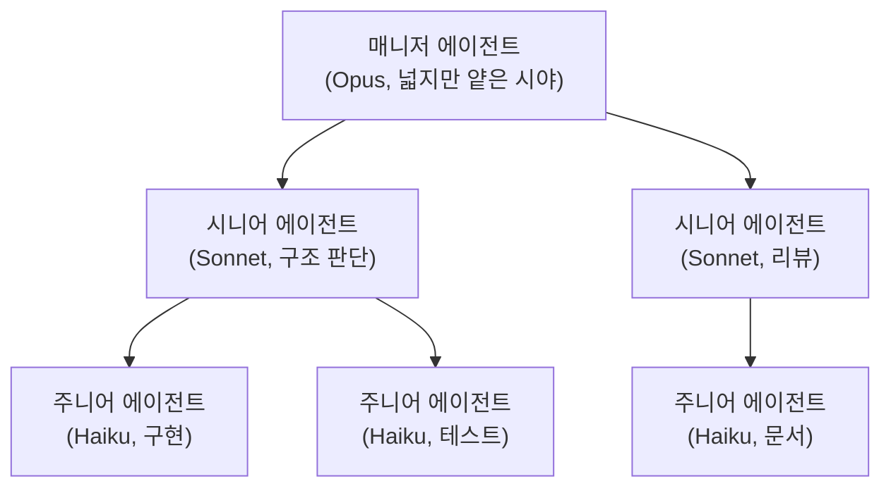

## 에이전트 5개를 동시에 돌린 날

Claude Code로 서브에이전트 5개를 동시에 띄웠다. 각각 프론트엔드, 백엔드 API, 테스트, 문서, 린트 수정을 맡겼다. 프롬프트도 꽤 정성 들여 썼고, CLAUDE.md에 아키텍처 규칙도 적어뒀다. 30분 뒤 결과를 열어봤다.

프론트엔드 에이전트가 백엔드 API 스키마를 자기 판단으로 바꿔놨다. 백엔드 에이전트는 원래 스키마대로 구현했다. 둘이 만든 코드는 당연히 안 맞았다. 테스트 에이전트는 깨진 API를 기준으로 테스트를 작성했고, 문서 에이전트는 아직 머지도 안 된 코드를 기준으로 README를 고쳤다. 린트 에이전트만 자기 일을 했다.

5개 에이전트가 동시에 일했는데 쓸 수 있는 결과물은 하나뿐이었다. 나머지 4개는 서로를 방해하느라 바빴다.

처음엔 에이전트가 부족하다고 생각했다. 프롬프트를 더 정교하게 다듬으면 되겠지. CLAUDE.md를 더 빡빡하게 쓰면 되겠지. 근데 한 달 더 실험해보고 나서야 깨달았다. 문제는 에이전트의 능력이 아니었다. 내가 5명에게 전체 맵을 보여주고 "알아서 최선을 다해"라고 말한 게 문제였다.

## 과도한 자유가 만드는 카오스

에이전트 팀이 망하는 패턴은 거의 비슷하다. 너무 많은 것을 한꺼번에 준다.

너무 많은 **권한**. 모든 에이전트가 모든 파일을 읽고 쓸 수 있다. Reviewer가 코드를 직접 고치고, Builder가 아키텍처를 자기 맘대로 바꾼다.

너무 많은 **컨텍스트**. 전체 레포, 전체 로드맵, 전체 결정 로그를 다 넣어준다. 정작 지금 작업에 필요한 건 파일 3개인데.

너무 큰 **목적**. "제품을 개선해", "최적 구조를 찾아", "보안도 고려해서 잘 해". 게임으로 치면 "세상을 구해라"만 주고 아무것도 안 알려준 거다.

너무 열린 **행동 공간**. 뭘 해도 되고 뭘 하면 안 되는지 구분이 없다. 그러니 에이전트는 자기 권한을 과대평가하고, 목적을 과대해석하고, 불필요한 최적화를 시도한다.

이걸 사람에게 대입하면 바로 감이 온다. 첫날 출근한 주니어 개발자에게 "회사 전체 코드베이스 접근권 줄게, DB도 건드려도 돼, 제품 목표는 알아서 해석해서 최고의 결과를 내봐"라고 하면 어떻게 될까. 대부분 망한다. 근데 이상하게 에이전트한테는 그걸 기대한다. 마법처럼 보이니까.


## 게임이 가르쳐주는 것

게임은 자유를 없애는 시스템이 아니다. 의미 있는 자유만 남기고 나머지를 제거하는 시스템이다.[^1]

좋은 게임을 떠올려보면 공통점이 있다.

세계관이 있다. 직업이 있다. 각 직업에 스킬이 정해져 있다. 인벤토리에 한계가 있다. 퀘스트가 잘게 쪼개져 있고, 각 퀘스트에 승리 조건과 실패 조건이 명시돼 있다. 레벨에 따라 가능한 행동이 다르다. 그리고 모든 행동은 로그로 남는다.

이걸 에이전트 운영에 대입하면 거의 그대로 먹힌다.

권한은 **스킬**이 된다. "이 에이전트는 무엇이든 할 수 있다"가 아니라, `read_repo`, `edit_tests_only`, `run_linter`, `request_human_approval` 같은 허용된 행동 목록을 갖는 캐릭터가 된다.

컨텍스트는 **시야**가 된다. 게임 캐릭터가 맵 전체를 한 번에 다 보지 않듯이, Worker는 현재 task와 관련 파일만 보고, Reviewer는 diff와 정책 문서만 보고, Coordinator는 sprint board만 본다. 이렇게 바꾸면 컨텍스트 제한이 "기억력 부족 문제"가 아니라 의도적으로 설계된 시야가 된다.

목적은 **퀘스트**가 된다. "제품을 개선해"가 아니라, 퀘스트 이름, 승리 조건, 실패 조건, 제한 비용, 금지 행동, 다음 핸드오프가 적힌 미션 패킷을 준다.

감사는 **리플레이**가 된다. 누가 언제 어떤 스킬을 썼는지, 어떤 컨텍스트를 로드했는지, 어떤 규칙에 막혔는지가 전부 기록된다. 무거운 거버넌스가 아니라 그냥 플레이 기록이다.

이 프레임의 핵심은 한 문장으로 줄여진다. **에이전트를 믿지 말고, 세계를 설계하자.**

## 번역 테이블: 인간 조직 × 게임 × 에이전트

세 세계의 개념을 나란히 놓으면 구조가 선명해진다.

| 인간 조직 | 게임 메카닉 | 에이전트 팀 |
|----------|-----------|------------|
| 직급 (주니어/시니어) | 클래스 | 모델 티어 + 역할 분리 |
| 인건비 | 에너지/자원 | 토큰 + 컨텍스트 윈도우 |
| 접근 권한 | 스킬셋 | tool permission |
| need-to-know | 시야 (fog of war) | 컨텍스트 예산 배분 |
| 티켓/스프린트 | 퀘스트 | task packet + 완료 조건 |
| 코드리뷰/QA | 심판 시스템 | 테스트 + 린트 + approval gate |
| ADR/회의록 | 리플레이 로그 | 감사 체인 |
| 암묵지 + 문서 | 인벤토리 | 계층형 상태 메모리 |
| 온보딩 가이드 | 튜토리얼 | CLAUDE.md / AGENTS.md |
| 1:1 미팅 | 없음 (불필요) | 없음 (감정 관리 불필요) |

이 테이블에서 흥미로운 건 맨 아래 두 줄이다. 인간 조직에서 가져와야 하는 것과 버려야 하는 것이 동시에 보인다.

가져와야 하는 건 **구조적 장치**들이다. 역할 분리, 승인 체계, 결정 로그, 감사, 운영 지표. 이런 건 복잡성과 사고 확산을 막기 위해 수백 년에 걸쳐 만들어진 것들이라 에이전트 조직에도 거의 그대로 적용된다.[^2]

버려도 되는 건 **사람이기 때문에 필요했던 것**들이다. 감정 관리, 동기부여, 정치적 완충, 1:1 미팅. 에이전트는 자존심 충돌도 없고 번아웃도 없다. 대신 새로 생기는 건 컨텍스트 예산 관리, 시야 제한, 권한의 기계적 통제, 행동 리플레이 같은 것들이다.

## 토큰 예산은 인건비다

인간 조직에서 인건비가 조직 구조를 만든다. 시니어를 사소한 일에 계속 붙이면 낭비고, 모든 사람이 모든 회의에 참석하면 비효율이다. 병목 역할에 일이 몰리면 전체 생산성이 떨어진다.

에이전트 조직도 똑같다. 다만 화폐가 다를 뿐이다.

고성능 모델(Opus급)을 단순 포맷 변환에 쓰면 낭비다. 모든 에이전트에 전체 레포와 로드맵과 결정 로그를 다 넣으면 토큰 비용이 폭증한다. 매 단계마다 다중 에이전트 합의를 돌리면 속도가 죽는다. Coordinator 하나가 모든 판단을 독점하면 병목이 된다.

그래서 에이전트 조직 설계는 사실상 "토큰 경제학이 있는 조직 설계"다.[^3]



사람 조직에서 시니어/주니어를 섞어 쓰듯이, 에이전트도 모델을 계층화할 수 있다. 저가 모델은 분류, 포맷 변환, 초안 생성을 맡고, 중간 모델은 구현과 분석을, 고가 모델은 구조 결정과 애매한 트레이드오프 판단을 맡는다. 이건 인건비 설계와 거의 같은 문제다.

실제로 내 블로그 프로젝트에서 이걸 적용해봤다. 글의 초안 생성은 Opus가 맡고, AI slop 검수는 Sonnet이, 밈 생성이나 포맷 정리 같은 건 Haiku가 한다. 초안 하나에 드는 비용이 Opus 올인 대비 약 40% 줄었다. 사람 팀에서 시니어가 아키텍처를 잡고 주니어가 구현하는 것과 같은 구조다.

여기서 한 가지 솔직히 인정할 게 있다. 나도 아직 이 티어링을 완벽하게 운영하지는 못한다. 습관적으로 모든 작업에 Opus를 붙이고 싶은 유혹이 있고, 어떤 작업이 Haiku로 충분한지 판단하는 것 자체가 경험이 필요하다. 근데 방향은 확실하다.

## 게임판을 만드는 5단계

처음부터 "에이전트 회사"를 만들려 하면 망한다. 사람 조직도 3명 팀과 300명 조직은 전혀 다르듯이, 에이전트 팀도 단계가 있다.

**1단계: 단일 에이전트 + 외부 기억.** 에이전트를 늘리지 말고 먼저 기억 외부화를 붙인다. 결정 로그, 작업 패킷, 스프린트 상태를 파일로 관리한다. 이것만으로도 세션 간 맥락 유실이 크게 줄어든다.

**2단계: Builder + Reviewer 분리.** 구현과 검증을 나누는 것만으로 체감이 달라진다. 같은 에이전트가 만들고 검토하면 자기 코드의 문제를 못 본다. 사람도 마찬가지 아닌가.

**3단계: Coordinator 추가.** 작업 분배와 컨텍스트 주입을 담당하는 상위 에이전트를 도입한다. 이때부터 manager pattern이 된다. OpenAI Agents SDK도 이 패턴을 멀티에이전트의 기본 형태로 제시한다.[^4]

**4단계: Archivist 추가.** 이게 은근히 중요하다. 에이전트 팀이 장기적으로 무너지는 이유는 구현력 부족보다 기억 갱신 부재다. 변경 후 요약을 갱신하고, 결정 로그를 쌓고, 낡은 문서를 표시하는 역할이 있어야 한다.

**5단계: 역할별 권한 차등화.** Builder는 특정 디렉토리만 write. Reviewer는 comment만. Release 에이전트는 main 브랜치 접근에 승인 필요. 여기까지 오면 진짜 팀처럼 보이기 시작한다.

근데 해보니까 달랐던 게 하나 있다. 3단계에서 4단계로 가는 게 제일 어려웠다. Coordinator까지는 기존 하네스 패턴의 연장이라 자연스러운데, Archivist는 "지금 당장 보이는 결과물"이 아니라 "3주 뒤에 빛을 발하는 인프라"라서 자꾸 우선순위에서 밀린다. 그래서 4단계를 의식적으로 먼저 끼워넣는 게 좋다.

## 실전: 게임 룰북의 뼈대

하네스 문서가 README가 아니라 게임 룰북이 되면 구조가 달라진다. 참고용으로 뼈대를 하나 그려봤다.

```
AGENT_GAME_RULES.md
├── 1. 세계관 (World)
│   ├── 제품 목표
│   ├── 아키텍처 경계
│   ├── 보안 규칙 (불변)
│   └── 금지 구역 (건드리면 안 되는 파일/서비스)
│
├── 2. 클래스 정의 (Classes)
│   ├── Builder: 구현 담당, write 권한, 특정 디렉토리 한정
│   ├── Reviewer: 품질 검증, read + comment만
│   ├── Coordinator: 작업 분배, sprint board 관리
│   ├── Archivist: 결정 로그/문서/요약 갱신
│   └── Gatekeeper: 배포 전 체크, 정책 위반 탐지
│
├── 3. 스킬 매트릭스 (Skills)
│   ├── read_repo, edit_src, edit_tests, run_linter
│   ├── open_pr, approve_pr, request_human_review
│   └── 각 클래스별 허용/금지 스킬 테이블
│
├── 4. 퀘스트 템플릿 (Quest Format)
│   ├── 퀘스트 이름
│   ├── 승리 조건 (구체적, 측정 가능)
│   ├── 실패 조건
│   ├── 컨텍스트 예산 (최대 토큰)
│   ├── 금지 행동
│   ├── 참조 가능 정보
│   └── 다음 핸드오프 대상
│
├── 5. 상태 계층 (State Layers)
│   ├── 헌법층: 절대 규칙 (보안, 코딩 원칙, 금지사항)
│   ├── 프로젝트층: 아키텍처, 도메인, 팀 규칙
│   ├── 스프린트층: 이번 주 우선순위, 진행 이슈
│   └── 작업층: 지금 이 퀘스트의 입출력
│
├── 6. 심판 시스템 (Judges)
│   ├── 자동: 테스트, 린트, 타입 체크
│   ├── 피어: Reviewer 클래스의 sign-off
│   └── 인간: 구조 변경, 배포, 민감 파일 수정
│
└── 7. 리플레이 로그 (Replay)
    ├── 누가(who) 어떤 퀘스트를(what)
    ├── 어떤 컨텍스트로(based on) 어떤 행동을(action)
    ├── 결과는(result) 누가 승인했는지(approved by)
    └── → decisions/ 디렉토리에 자동 적재
```

이건 완성형이 아니다. 자기 프로젝트에 맞게 깎아야 한다. 중요한 건 문서의 구조가 아니라 사고방식의 전환이다. "에이전트에게 뭘 알려줄까"에서 "에이전트가 플레이할 세계를 어떻게 설계할까"로.

## 이 게임은 아직 얼리 액세스다

이 글에서 그린 그림을 완전히 구현한 시스템은 아직 본 적이 없다. 나도 5단계 중 2~3단계 어딘가에 있고, 업계 전체가 "에이전트 팀 운영"의 초입이다. OpenAI, Anthropic, Raschka 모두 모델보다 주변 시스템이 중요하다고 말하기 시작했지만[^4][^5][^6], 그걸 게임 디자인 수준으로 구조화한 사례는 아직 드물다.

에이전트가 더 똑똑해질 때까지 기다릴 건가, 아니면 지금 있는 에이전트로 더 잘 돌아가는 게임판을 만들 건가. 더 힘 센 캐릭터를 기다리는 것보다 더 좋은 던전을 설계하는 게 먼저다.

[^1]: Jesse Schell, *The Art of Game Design* (2008). 게임 디자인의 핵심은 "의미 있는 선택(meaningful choices)"을 만드는 것이라는 정의가 에이전트 운영에도 그대로 적용된다.
[^2]: Brooks, *The Mythical Man-Month* (1975). "Adding manpower to a late software project makes it later." 에이전트 조직에서도 에이전트 수를 늘리면 동기화 비용(컨텍스트 공유)이 기하급수적으로 증가한다.
[^3]: 이 표현은 ideation 과정에서 나온 것인데, 실제로 에이전트 운영 비용의 대부분이 토큰 소비에서 나온다. Anthropic Claude Opus 기준 입력 $15/1M, 출력 $75/1M (2026년 4월 기준).
[^4]: [OpenAI: A practical guide to building agents](https://cdn.openai.com/business/v2/docs/OpenAI-Orchestrating-Agents-Guide.html). Orchestrator-Worker, manager pattern, handoff 메커니즘을 멀티에이전트의 기본 패턴으로 제시.
[^5]: [Anthropic: Building effective agents](https://www.anthropic.com/engineering/building-effective-agents) (2025). 복잡한 프레임워크보다 단순하고 조합 가능한 패턴이 실전에서 더 잘 먹힌다.
[^6]: [Sebastian Raschka: Components of a Coding Agent](https://magazine.sebastianraschka.com/p/components-of-a-coding-agent). 좋은 코딩 경험의 상당 부분은 모델 자체보다 주변 시스템(하네스)에서 나온다.
