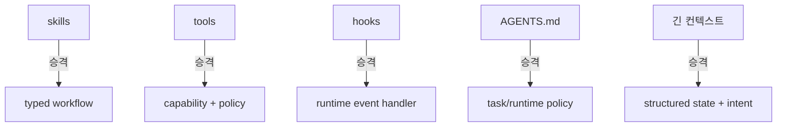

## 하루에 만 줄이 넘어가기 시작했다

AI로 코딩을 하면서 어느 순간 체감이 달라졌다. 처음엔 안심이 됐다. 내가 언제든 따라 내려가서 읽을 수 있으니까. 파이썬이든 타입스크립트든, 모르는 코드가 나오면 열어보면 된다. 그 가능성 자체가 통제감을 줬다.

근데 하루에 만 줄 정도를 생산하기 시작하면 그 안심이 흔들린다. 따라가 볼 수 있다는 가능성과 실제로 전체를 관리할 수 있다는 가능성은 다른 얘기였다. 예전에는 이 둘이 거의 같았다. 쓸 수 있는 양과 읽을 수 있는 양이 비슷했으니까. AI가 그 균형을 깼다.

이게 단순히 "코드가 많아졌다"는 이야기가 아니다. 개발환경이라는 것 자체가 인간의 생산량에 맞춰 설계되어 있었다는 걸 깨달은 거다.

## 인간을 위해 만들어진 것들

코드리뷰, 컨벤션, 테스트, 함수 분리, 명확한 이름짓기, 문서화. 좋은 개발 습관이라고 불리는 것들은 전부 하나의 전제 위에 있다.

> 코드는 결국 인간이 쓰고, 인간이 읽고, 인간이 리뷰하고, 인간이 유지보수한다.

언어, 프레임워크, IDE, 쉘. 다 인간의 생산량과 이해량을 기준으로 맞춰져 있다. 쉘은 사람이 한 줄씩 명령하고 파이프를 조합하는 인터페이스다. 로그는 사람이 실시간으로 `tail -f` 하며 보는 걸 전제로 설계됐다. 에러 메시지는 사람이 읽고 다음 행동을 정하는 구조다.

이 전제가 유효한 동안은 문제가 없었다. 쓰는 속도와 읽는 속도가 비슷하면, 코드 자체가 곧 진실의 원천(source of truth)이 된다. 코드를 잘 쓰면 이해 가능한 시스템이 된다.

근데 AI가 작업자가 되면 이 전제가 깨진다.

## 지금 우리가 실제로 하고 있는 것

AI 코딩 에이전트를 깊게 써본 사람이라면 이런 파일들이 익숙할 거다. 2026년 기준으로 60,000개 이상의 오픈소스 프로젝트가 AGENTS.md를 사용하고 있다.[^2]

- `AGENTS.md`: 에이전트에게 아키텍처와 규칙을 알려주는 문서
- `CLAUDE.md`: Claude Code의 프로젝트 지시 파일
- `skills/`: 재사용 가능한 작업 프로토콜
- `hooks`: 특정 이벤트에 반응하는 셸 스크립트
- system prompt: 세션마다 주입되는 긴 지시문

겉보기엔 다 다른 것 같지만, 하는 일은 비슷하다. 전부 "에이전트가 이 상황에서 어떻게 행동해야 하는지"를 바깥에서 주입하는 장치다.

잘 설계된 시스템이라면 이런 것들 중 상당수는 컨텍스트가 아니라 런타임 구조로 들어가 있어야 한다. 허용된 행동 범위, 실패 시 fallback, 어떤 디렉토리는 읽기 전용인지, 어느 조건에서 사람 승인이 필요한지. 이건 매번 "기억해"라고 텍스트로 전달할 게 아니라 시스템이 강제하거나 최소한 구조적으로 표현해야 하는 것들이다.

근데 현재 에이전트 시스템은 기본적으로 이런 구조다:

이 얇은 연결 위에 서 있다. 그래서 원래 아래에 있어야 할 것들이 전부 위로 새어나온다. 상태 추적, 권한 경계, 체크포인트, 변경 이유 기록, 승인 지점, 감사 로그, 복구 가능성. 전부 제품 안에 1급 개념으로 없으니까, 사람들이 문서와 관례로 메우고 있다.

거칠게 말하면 이거다.

**에이전트용 OS가 없어서, 사람들이 마크다운으로 임시 OS를 짜고 있다.**

## 컨텍스트는 정책이 아니다

이게 단순히 불편한 수준이 아니라 구조적 한계라는 증거가 있다. 2026년 3월, ETH Zurich 연구팀이 AGENTS.md의 실제 효과를 측정했다.[^1]

결과가 흥미롭다. LLM이 자동 생성한 AGENTS.md 파일은 에이전트의 작업 성공률을 평균 3% 떨어뜨리면서 추론 비용을 20% 이상 올렸다. 인간이 직접 작성한 파일은 성공률을 4% 올렸지만 비용 역시 19% 증가했다. 연구팀의 설명은 이렇다: "에이전트가 지시를 너무 문자 그대로 따른다. 과도한 테스트, 불필요한 파일 탐색, 중복 품질 검사로 이어진다."[^1]

이걸 내 경험에 비추면 납득이 간다. 하네스를 정교하게 짤수록 에이전트가 "규칙 따르기"에 토큰을 소비한다. 정작 문제를 푸는 데 쓰여야 할 자원이 규칙 해석에 빠지는 거다.

근본적인 문제는 이거다. 컨텍스트는 선언처럼 보이지만 실제로는 약한 힌트에 불과하다.

- 읽을 수도 있고 놓칠 수도 있다
- 충돌할 수도 있고 길어질수록 희석된다
- 상태를 가지지 않는다. 현재 작업 단계에 따라 살아 움직이지 못한다
- 감사 가능성이 없다. 어떤 지시가 실제로 행동에 영향을 미쳤는지 추적할 수 없다

그래서 작업이 길어지면 자꾸 이렇게 된다. 계약이 안 지켜져서 명령을 취소하고 다시 시킨다. 상태가 꼬여서 처음부터 다시 한다. 쌓이면 쌓일수록 AI도 힘들고 나도 힘들다.

## 문서가 운영체제 역할을 떠맡으면

skills는 사실 재사용 가능한 작업 프로토콜이다. tools는 권한이 붙은 capability다. hooks는 이벤트 기반 정책 엔진이다. AGENTS.md는 작업 정책과 경계 정의다.

근데 지금은 이게 전부 서로 다른 레이어에서 제각각 텍스트로 존재한다. 그 결과 에이전트는 "운영체제"를 쓰는 게 아니라 거대한 설명서를 읽고 눈치껏 행동하는 상태가 된다.

문서가 정책의 자리를 차지하면 시간이 지날수록 꼬인다.

- 중복된다. skills에도 있고 hooks에도 있고 system prompt에도 있다
- 충돌한다. 어느 게 최신인지, 어느 게 강한 규칙인지 애매하다
- 최신성이 깨진다. 코드는 바뀌었는데 문서는 옛날 그대로다
- 에이전트도 다 못 읽는다. 길어질수록 핵심이 묻힌다
- 결국 또 다른 문서가 필요해진다

이건 초기 인터넷 시절 수많은 설정 파일과 비슷하다. `.htaccess`, `httpd.conf`, 온갖 rc 파일들. 시스템이 아직 제품화되지 않은 운영 개념의 흔적이었다. 지금의 AGENTS.md도 그런 과도기적 artifact에 가깝다.

## 시스템이 가져가야 할 것들

하네스가 지금 대신 떠맡고 있는 것들의 목록을 정리하면 이렇다.

**상태 관리**: 현재 작업이 어느 단계인지, 이전 시도에서 뭘 배웠는지, 이번 태스크에만 적용되는 제약이 뭔지. 지금은 대화 흐름 속에 퍼뜨려져 있어서 시간이 지나면 에이전트도 사람도 현재 상태를 못 잡는다.

**계약 강제**: "이렇게 해라"는 많지만 런타임이 보장하지 않는다. prompt에 가깝지 policy가 아니다.

**감사 로그**: 이 행동이 어떤 규칙 때문에 나왔는지, 어떤 컨텍스트가 실제로 영향을 미쳤는지 추적이 안 된다.

**스냅샷과 롤백**: 에이전트가 뭔가 이상한 걸 했을 때, 그 시점으로 되돌리고 같은 입력으로 재실행하는 게 쉬워야 한다.

**작업 단위**: 지금은 "세션"이라는 모호한 단위밖에 없다. 목표, 성공 조건, 금지 영역, 승인 필요 지점이 구조화된 task spec이 기본 단위가 되어야 한다.

이걸 텍스트에서 구조화된 실행 개념으로 내리면 이런 그림이 된다:

## 만드는 것보다 살리는 것이 더 비싸다

여기서 한 발 더 나가면, 에이전트 시스템이 이런 런타임을 갖추는 게 왜 중요한지가 보인다.

지금 AI 코딩 에이전트에 대한 열광은 대부분 "만드는 속도"에 집중되어 있다. 프로토타입이 빨라졌다, MVP를 하루 만에 띄웠다, 혼자서 앱을 만들었다. 맞는 이야기고, 진짜로 가능해졌다.

근데 소프트웨어 엔지니어링의 진짜 큰 비용은 원래 거기가 아니었다. 만드는 것(creation)보다 계속 굴리는 것(continuation)이 항상 더 비쌌다.

아키텍처를 거의 새로 짜는 수준의 리팩토링이 한두 번이 아니고, 장애가 터지면 원인을 찾아 3일을 쓰고, 사용자가 늘면서 비용 구조를 뜯어고쳐야 한다. 핵심 개발자가 빠져도 무너지지 않는 구조를 만들어야 하고, 배포가 특정 사람에게 의존하면 그 사람이 휴가를 못 간다.

10년 넘게 같은 문제를 풀어서 살아남은 팀들을 보면, 겉으로는 "같은 제품"이지만, 내부에서는 시스템과 조직과 운영 방식을 여러 번 재구성했다. 초기 아이디어가 좋아서가 아니라 문제를 오래 붙들면서 진화한 팀들이다.

이 구간에서 필요한 건 "코드를 더 빨리 생성하는 AI"가 아니다. 점점 커지는 시스템을 이해 가능하고 변경 가능한 상태로 유지하는 AI, durable software를 함께 관리하는 운영 보조자가 훨씬 더 큰 가치를 가진다.

그리고 이걸 가능하게 하려면 에이전트가 문서를 읽고 눈치로 행동하는 수준으로는 안 된다. 상태를 가진 런타임, 작업 이력을 구조적으로 남기는 시스템, 인간이 개입하고 승인할 수 있는 운영 인터페이스. 지금 하네스가 흉내 내고 있는 바로 그것들이 제품이 되어야 한다.

## 하네스는 아직 중요하다. 하지만.

오해하지 않았으면 한다. 나는 지금 이 순간 Claude Code의 하네스를 누구보다 많이 쓰는 사람 중 하나다. CLAUDE.md를 정교하게 다듬고, skills를 만들고, hooks를 걸고, 작업 흐름을 설계한다. 그리고 효과가 있다. 지금 단계에서 하네스를 잘 만드는 사람이 가장 생산적인 사람인 건 맞다.

근데 많이 쓸수록 보이는 게 있다. 같은 규칙을 세 번째 설명하고 있는 나. 상태가 꼬여서 세션을 새로 시작하는 나. 에이전트가 5분 전에 한 약속을 잊어버려서 되돌리는 나. 이건 하네스를 더 정교하게 만들면 해결되는 문제가 아니다. 하네스가 메우고 있는 자리에 제품이 들어와야 풀리는 문제다.

정교한 하네스는 과도기 최적해다. 부족한 런타임과 인터페이스를 대신 메우는 외장 구조물. 유효하지만 종착점은 아니다.

다음 단계는 이 구조물들이 맡고 있던 역할을 시스템으로 내려보내는 것이다. 그때 진짜 변화가 올 거다.

에이전트에게 진짜 운영체제를 줄 수 있는 사람이 누구인지. 그게 앞으로 꽤 중요한 질문이 될 것 같다.

[^1]: [InfoQ — New Research Reassesses the Value of AGENTS.md Files for AI Coding](https://www.infoq.com/news/2026/03/agents-context-file-value-review/)
[^2]: [AGENTS.md — A simple, open format for guiding coding agents](https://agents.md/)
