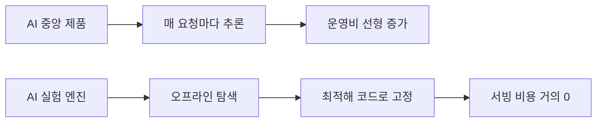

## AI를 중앙에 놓으면 왜 돈이 안 되는가

AI로 제품을 만들어본 사람이면 한 번쯤 이런 경험이 있을 거다. 데모는 기가 막히게 잘 돌아간다. 투자자 앞에서 보여주면 눈이 반짝거린다. 근데 실제 고객한테 넣으면 결과가 들쭉날쭉하고, 엣지 케이스를 잡으려 하면 프롬프트가 끝없이 길어지고, 매달 추론 비용이 쌓이는데 고객은 "그래서 정확히 뭐가 좋아졌는데?"를 잘 모른다.

이게 지금 AI를 제품의 중앙 두뇌로 쓰는 많은 팀이 겪는 현실이다.

문제의 구조는 간단하다. AI — 특히 LLM — 를 서비스의 핵심 실행 엔진으로 두면 세 가지가 동시에 터진다. 결과가 비결정적이라 재현이 안 되고, 책임 경계가 모호해지고, 추론 비용이 매 요청마다 운영비로 나간다. 한두 달은 버틸 수 있지만, 스케일하면 원가 구조가 터진다.

2026년 기준으로 AI SaaS 투자에 적색 신호가 켜졌다는 분석이 나오고 있다.[^1] feature moat — 그러니까 기능으로 차별화하는 벽 — 이 거의 사라졌다는 거다. 2024년에 개발팀이 2-6주 걸려 만들던 SaaS 기능을, 2026년에는 Cursor나 Claude Code로 하루 만에 만든다. 그러면 LLM 위에 얇은 업무용 껍데기를 씌운 제품은 어떻게 되나? 범용 모델이 좋아질수록 차별점이 녹는다.

## 불확실성을 먹고 확실성을 파는 구조

그러면 AI를 어디에 써야 하나?

한 가지 관점 전환이 있다. AI를 제품의 두뇌가 아니라 **R&D 부서**로 쓰는 것. 실서비스에서 매번 LLM을 호출하는 게 아니라, 오프라인에서 AI가 가능한 해를 대량으로 탐색하고 그중 재현 가능하고 결정론적인 해만 제품에 채택하는 구조.

이게 왜 되는 걸까? 사람들이 "마법 같다"고 느끼는 기능 — 예측, 추천, 자동화, 개인화 — 이것들의 상당수는 사실 결정론적 프로그래밍으로 만들 수 있다. 예측처럼 보이는 분류, 지능처럼 보이는 검색/정렬, 자동화처럼 보이는 조건 분기, 개인화처럼 보이는 세그먼트별 규칙. LLM 없이도 가능한 것들이다. 문제는 그 최적의 규칙과 구조를 사람이 찾기 어렵다는 거다.

여기서 AI의 진짜 가치가 생긴다. **답을 내는 기계가 아니라 해 공간을 빠르게 탐색하는 기계**로.

이 구조의 장점은 소프트웨어의 본질적 강점이 살아난다는 거다. 결과가 재현 가능해지고, 디버깅이 되고, 비용 예측이 가능해지고, 성능 개선 경로가 명확해지고, 고객에게 가치 설명이 쉬워진다.

그리고 결정적으로 — 추론비의 성격이 바뀐다.

## 추론비를 운영비에서 개발비로

매일 LLM을 호출하면서 서비스하는 구조에서는 추론 비용이 운영비다. 사용자가 늘면 비용이 선형으로 증가한다. 입력 기준 $3/1M 토큰이라 치면, 하루 500번 호출하는 서비스의 연간 추론비가 수십만 달러 단위로 올라갈 수 있다.

근데 AI로 최적 구조를 찾고 그걸 코드/룰/파라미터로 고정하면? 추론비가 개발비로 전환된다. R&D 단계에서만 돈이 들고, 서비스 단계에서는 결정론적 시스템이 돌아간다. 원가 구조가 SaaS스럽게 바뀌는 거다.

이게 작은 차이 같지만 사업적으로는 엄청 크다. 매번 추론하면서 서비스하는 구조는 마진이 계속 깎이는데, 한 번 탐색하고 굳히는 구조는 서빙 비용이 거의 0에 수렴한다.

## 630줄로 밤새 100번 실험을 돌린 사람

이 방향을 가장 날카롭게 보여주는 사례가 Andrej Karpathy의 autoresearch다.[^2]

2026년 3월에 공개된 이 프로젝트는 630줄짜리 Python 스크립트 하나로 AI 에이전트가 ML 실험을 자율적으로 반복하게 한다. 구조는 극단적으로 단순하다. 에이전트가 `train.py`를 수정하고, 정확히 5분간 훈련하고, 검증 손실(val_bpb)을 측정하고, 개선됐으면 유지하고 아니면 버린다. 시간당 약 12번, 밤새 돌리면 약 100번의 실험이 가능하다.

여기서 중요한 건 역할 분담이다. 사람은 `program.md`라는 파일을 통해 실험 환경, 규칙, 제약 조건을 설계한다. AI는 그 안에서 수정-실행-평가-채택/폐기를 반복한다. 사람이 샌드박스를 설계하고, AI가 샌드박스 안에서 무한 턴을 돈다.

700번의 실험을 이틀 만에 돌려서 20개의 최적화를 발견했고[^3], Shopify CEO Tobi Lütke는 이걸 내부 쿼리 확장 모델에 적용해서 37번의 실험으로 19% 검증 점수를 개선했다.[^3]

이게 "AI가 연구를 대신한다"가 아니라는 점에 주목해야 한다. AI가 잘 작동한 이유는 샌드박스가 극도로 잘 정의돼 있었기 때문이다. 수정 대상은 파일 하나, 시간 예산은 5분 고정, 비교 지표는 val_bpb 하나. 이 제약이 없으면 AI는 그냥 비싼 잡음 생성기가 된다.

## AI SaaS는 왜 리셀러가 되고 있나

이 관점에서 지금 시장을 보면 많은 AI SaaS가 구조적으로 위험하다는 게 보인다.

원래 소프트웨어 회사가 방어력을 가지려면 세 가지 중 하나를 쥐어야 했다. 독점적인 데이터, 강한 워크플로우 락인, 명확한 결과 책임. 근데 요즘 많은 AI SaaS는 이 셋이 다 약하다. 데이터는 고객 거고, 워크플로우는 챗 인터페이스라 대체 가능하고, 결과 책임은 "모델이 그랬어요"로 흐려진다.[^1]

그러면 누가 돈을 버느냐? 기반 모델과 인프라를 파는 쪽이다. 앱 레이어는 CAC는 높은데 방어력은 약하고, 마진도 추론비에 계속 깎인다.

코딩 에이전트나 범용 챗봇만 봐도 알 수 있다. Claude Code, Codex — 이것들의 범용성은 이미 너무 강해서, 대부분의 vertical AI app이 결국 이 질문에 부딪힌다. "이걸 굳이 별도 제품으로 써야 하나? ChatGPT에 프롬프트 좀 잘 쓰면 되는 거 아닌가?"

이 질문에 답 못하면 오래 못 간다.

## 그래서 뭘 만들어야 하나

AI 시대에 진짜 남을 가능성이 있는 제품은 두 부류라고 본다.

하나는 **시스템 오브 레코드를 가진 쪽**. 업무 데이터, 승인 흐름, 히스토리, 협업 맥락, 책임 구조를 잡고 있는 제품. AI는 기능일 뿐이고 본체는 워크플로우와 데이터 락인.

다른 하나는 **실험 인프라를 파는 쪽**. 좋은 목적함수를 정의하고, 가설을 나누고, AI에게 탐색을 돌리고, 결과를 비교하고, 최적해를 결정론적 시스템에 굳히는 프레임워크. autoresearch가 ML 연구에서 보여준 걸, 마케팅이나 채용이나 세일즈에 적용하는 것.

"AI가 일을 대신한다"는 프레이밍은 매력적이지만 위험하다. 더 정확한 프레이밍은 이거다.

**AI는 불확실성을 먹고, 제품은 확실성을 판다.**

AI가 수천 개의 가설을 탐색하고, 사람이 승리 조건과 제약을 설정하고, 결정론적 시스템이 검증된 답을 서빙한다. 이 삼각 구조가 더 싸고, 더 강하고, 더 팔기 쉽다.

솔직히 이건 아직 증명된 길이라기보다 감각에 가깝다. autoresearch는 ML 실험이라는 매우 잘 정의된 영역에서 작동했고, 이걸 비정형 업무에 그대로 옮기는 건 쉽지 않을 거다. 승리 조건이 하나가 아니라 서로 충돌하는 경우, 실험이 불가능하거나 피드백이 느린 영역, 목적함수 자체가 조직 정치의 산물인 경우 — 이런 데서는 깨질 수 있다.

근데 방향은 맞다고 생각한다. 많은 AI SaaS는 사실 소프트웨어가 아직 굳지 않은 상태를 AI로 때우고 있는 것일 수도 있다. "이걸 왜 매번 추론하지? 구조를 찾은 뒤 굳혀버리면 되잖아." 이 질문이 더 자주 나올수록 시장은 건강해질 거다.

[^1]: [Medium — AI Killed the Feature Moat: What Actually Defends Your SaaS Company in 2026](https://medium.com/@cenrunzhe/ai-killed-the-feature-moat-heres-what-actually-defends-your-saas-company-in-2026-9a5d3d20973b)
[^2]: [GitHub — karpathy/autoresearch](https://github.com/karpathy/autoresearch)
[^3]: [VentureBeat — Karpathy's autoresearch lets you run hundreds of AI experiments a night](https://venturebeat.com/technology/andrej-karpathys-new-open-source-autoresearch-lets-you-run-hundreds-of-ai)
