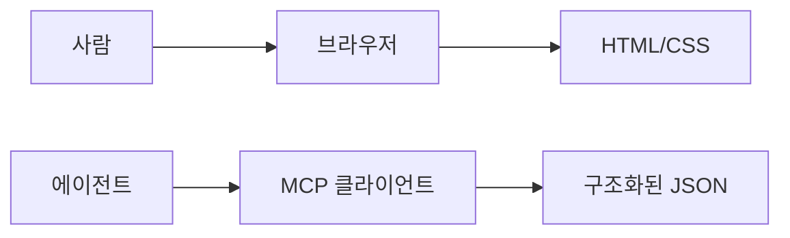
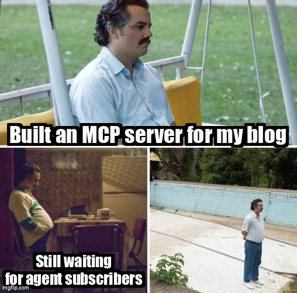

## 블로그를 만들면서 든 이상한 질문

블로그를 새로 만들기로 했을 때 처음 든 생각은 평범했다. Astro로 정적 사이트를 만들고, 마크다운으로 글을 쓰고, Cloudflare에 배포하면 끝이다.

근데 하나 걸리는 게 있었다. 사람은 브라우저를 열어서 글을 읽는다. AI 에이전트는? RSS를 파싱할 수도 있고 HTML을 크롤링할 수도 있지만 둘 다 비구조적이다. 에이전트가 "이 블로그에서 Context Window 관련 글을 찾아줘"라는 요청을 받으면, HTML을 긁어서 텍스트를 추출하고, 어떤 게 제목이고 어떤 게 본문인지 추측해야 한다.

2026년 기준으로 웹 트래픽의 상당 부분이 AI 크롤러와 에이전트에서 온다.[^1] Cloudflare는 2026년 3월에 "Markdown for Agents"를 발표했다. 네트워크를 통과하는 HTML 페이지를 자동으로 마크다운으로 변환해서 에이전트에게 제공하는 기능이다.[^2] 큰 회사들이 이 문제를 인프라 레벨에서 풀려고 하고 있다는 뜻이다.

근데 나는 반대 방향이 더 재미있다고 생각했다. HTML을 마크다운으로 변환하는 게 아니라, 처음부터 에이전트가 읽을 수 있는 구조로 설계하면 어떨까?

## 사람을 위한 인터페이스, 에이전트를 위한 인터페이스

사람을 위한 블로그 인터페이스는 잘 알려져 있다. 시각적 계층, 네비게이션, 반응형 레이아웃, 읽기 좋은 타이포그래피. 수십 년간 다듬어진 영역이다.

에이전트를 위한 인터페이스는 다른 걸 요구한다. 도구 이름만 보고 뭘 하는 건지 알 수 있어야 하고, 데이터가 구조화되어 있어야 하고, 검색이 가능해야 하고, 에러가 났을 때 다음에 뭘 해야 하는지 메시지가 안내해야 한다.

이걸 AX(Agent Experience)라고 부르는 사람들이 있다. UX의 에이전트 버전. 나도 그 방향이 맞다고 본다.

그래서 이 블로그는 두 개의 인터페이스를 가진다. 사람은 브라우저에서 HTML을 읽고, 에이전트는 MCP(Model Context Protocol) 서버를 통해 구조화된 JSON을 받는다.



## frontmatter가 에이전트용 인터페이스의 시작점이다

두 인터페이스의 공통 기반은 마크다운 파일의 frontmatter다. 이 블로그의 모든 글은 이런 구조를 가진다.

```yaml
title: '글 제목'
description: '사람 + 에이전트 모두가 참조하는 설명'
summary: '1-2문장 핵심 요약'
tags: ['AI', 'AX', 'MCP']
category: 'essay'
series: '시리즈명'
concepts:
  - name: 'Agent Experience'
    related: ['UX', 'MCP']
```

사람이 읽을 때는 `title`과 `tags`가 페이지에 렌더링된다. 에이전트가 읽을 때는 같은 데이터가 JSON으로 나간다. `description`은 검색 엔진과 에이전트 모두가 참조한다. `concepts`는 글 사이의 관계를 표현하는 지식 그래프의 원재료가 된다.

여기서 제일 고민했던 건 `concepts` 필드다. 각 글에 "이 글에서 다루는 개념"과 "그 개념이 어떤 다른 개념과 연결되는지"를 명시한다. 빌드 시점에 모든 글의 concepts를 모아서 adjacency list 그래프를 만든다. 현재 9개 글에서 28개 개념이 추출됐고, 이 그래프로 관련 글 추천과 novelty scoring이 가능하다.

솔직히 이게 과한 설계인지는 아직 모르겠다. 글이 100개 쌓이면 가치가 나올 수도 있고, 10개에서도 충분히 유용할 수도 있다. 근데 frontmatter에 적는 건 30초짜리 작업이고, 그래프 빌드는 빌드타임에 자동이니까 비용은 거의 0이다.

## MCP는 에이전트를 위한 RSS다

RSS는 1999년에 나왔다. 블로그 구독의 표준이 됐다. 사람이 RSS 리더로 새 글을 확인한다.

MCP(Model Context Protocol)는 2024년 11월에 Anthropic이 공개했다.[^3] AI 에이전트가 외부 시스템의 도구를 호출할 수 있는 표준 인터페이스다. 나는 이걸 "에이전트를 위한 RSS"로 본다.

RSS가 사람에게 "새 글이 올라왔어요"를 알려주듯, MCP는 에이전트에게 "이 블로그에서 이런 도구를 쓸 수 있어요"를 알려준다. 글 목록 조회, 키워드 검색, 자연어 질문, 개념 그래프 탐색, 다음 글감 추천까지.

이 블로그의 MCP 서버는 7개 도구를 제공한다. `list_posts`로 글 목록을 조회하고, `search_posts`로 키워드 검색을 하고, `ask_blog`로 자연어 질문을 던지고, `explore_concepts`로 개념 그래프를 탐색한다. 에이전트가 Claude Desktop이나 Cursor에서 이 서버에 연결하면 블로그의 모든 콘텐츠를 구조화된 형태로 접근할 수 있다.

연결 방법은 간단하다.

```json
{
  "mcpServers": {
    "mirlim-blog": {
      "url": "https://mirlim.blog/mcp"
    }
  }
}
```



솔직하게 말하면 현재 에이전트 사용자는 0명이다. MCP 서버를 만들었고, 도구 7개가 동작하고, Cloudflare Workers에서 서빙되고 있지만 아직 아무도 연결하지 않았다. MCP 생태계가 성숙하려면 에이전트가 웹을 탐색하면서 MCP 서버를 자동으로 발견하고 연결하는 흐름이 필요한데, 아직 그 단계는 아니다.

근데 RSS도 처음엔 그랬다. 프로토콜이 먼저 존재하고, 사용자는 나중에 온다. 준비돼 있으면 된다.

## AI 위젯을 얹는 것과 처음부터 설계하는 것

2026년에 "AI-native"라는 단어가 많이 쓰인다. 근데 대부분은 기존 사이트에 AI 챗봇 위젯을 달거나, 검색에 LLM을 붙이는 수준이다.

나는 "AI-native"를 다르게 정의한다. 구조, 콘텐츠, 인터페이스가 처음부터 AI 시스템이 이해하고 신뢰하고 행동할 수 있도록 설계된 것.[^1] 기존 사이트에 AI를 패치하는 게 아니라, AI가 읽을 수 있는 것을 기본값으로 두는 것.

이 블로그에서 그게 어떻게 구현되는지 정리하면 이렇다.

| 레이어 | 사람용 | 에이전트용 |
|--------|--------|-----------|
| 콘텐츠 접근 | 브라우저 + HTML | MCP + JSON |
| 메타데이터 | 페이지 제목, OG 태그 | frontmatter 전체 필드 |
| 검색 | 눈으로 스캔 | `search_posts` 도구 |
| 관계 탐색 | 관련 글 링크 | `explore_concepts` 그래프 |
| 구독 | RSS | MCP 서버 연결 |
| 질문 | 댓글/이메일 | `ask_blog` 도구 |

두 독자를 동시에 만족시키려면 한 쪽을 위해 다른 쪽을 희생하면 안 된다. 사람을 위한 읽기 경험이 에이전트 지원 때문에 나빠지면 본말이 전도된 거다. 그래서 에이전트용 인터페이스는 전부 별도 레이어(MCP, frontmatter, 빌드타임 인덱스)에 있고 사람이 보는 HTML에는 영향을 주지 않는다.

## 이 실험이 알려준 것

이 블로그를 만들면서 배운 건, 기술적인 구현보다 "에이전트를 위한 인터페이스"라는 사고방식 자체다.

사람을 위한 UI를 만들 때는 시각적 계층, 네비게이션, 반응형을 고민한다. 에이전트를 위한 인터페이스를 만들 때는 도구 이름만 보고 뭘 하는 건지 알 수 있는지, 에러 메시지가 다음 행동을 안내하는지, 반환 데이터가 구조화되어 있는지를 고민해야 한다.

이 시리즈의 다음 글에서는 이 블로그의 콘텐츠 파이프라인(Post Compiler)을 다루고, 그 다음에는 MCP 서버의 구현 디테일을 다룬다. 관심 있으면 MCP 서버에 연결해서 글을 읽어봐도 된다. 에이전트 독자 1호가 될 수 있다.

[^1]: [Flowout — AI-Native Architecture: The Next Standard for Enterprise Websites](https://www.flowout.com/blog/ai-website-predictions-2026)
[^2]: [Cloudflare Blog — Introducing Markdown for Agents](https://blog.cloudflare.com/markdown-for-agents/)
[^3]: [Anthropic — Introducing the Model Context Protocol](https://www.anthropic.com/news/model-context-protocol)
