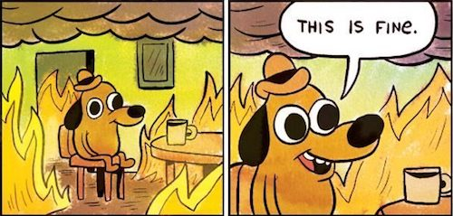

나는 꽤 오랫동안 왜 많은 조직이 쓸 만한 제품을 만들지 못하는지 궁금했다.

처음에는 흔히 이야기하는 이유들을 의심했다. 기술력이 부족해서인가. 좋은 디자이너가 없어서인가. 데이터가 부족해서인가. 도메인 전문가나 세일즈 역량이 부족해서인가.

직접 사업을 하며 여러 번 실패했고, 이후 여러 조직과 스타트업을 가까이에서 지켜보면서 점점 그것이 핵심 원인은 아니라는 생각이 들었다. 기술자도 있고 디자이너도 있고 전문가도 있고 데이터와 영업 채널까지 있는데도 아무도 계속 쓰지 않는 제품은 얼마든지 만들어진다. 반대로 자원도 부족하고 인원도 적은데 누군가의 일을 분명하게 바꾸는 제품도 있다.

그 차이가 뭔지 오래 고민하다가 최근에야 조금 선명해졌다. 대부분의 쓸모없는 제품에는 철학이 없었다. 정확히는, 세상과 인간과 일에 대해 제품이 주장하는 바가 없었다.

그 제품들은 대체로 보기 좋았다. 시장에서 인기 있는 기능을 갖추고 있었고 최신 기술을 적용했으며 전문가 검수도 받았다. 누구에게 보여줘도 크게 욕먹을 부분은 없었다. 그런데 사용자가 기존 방식을 버리고 그 제품을 선택해야 할 이유 역시 없었다. 나쁘지는 않지만 굳이 쓸 필요가 없는 제품이었다.

## 좋은 제품은 세상에 대한 하나의 주장이다

이 감각을 나보다 먼저, 훨씬 거칠게 말한 사람들이 있다. Basecamp를 만든 37signals는 2006년 『Getting Real』에서 이렇게 썼다.

> 어떤 사람들은 소프트웨어가 중립적이어야 한다고 말한다. 개발자가 기능을 제한하거나 기능 요청을 무시하는 건 오만하다고. 우리는 그게 헛소리라고 생각한다. 최고의 소프트웨어에는 비전이 있다. 최고의 소프트웨어는 편을 든다. 사람들이 소프트웨어를 쓸 때 찾는 건 기능이 아니라 접근 방식이고 비전이다.[^1]

편을 든다(takes sides). 이 표현이 핵심이다. 좋은 제품은 기능의 집합이기 전에 세상에 대한 하나의 주장이다. 사람들은 지금 이렇게 일하고 있지만 사실 저렇게 일하는 편이 더 낫다는 주장.

그리고 그 주장은 대체로 새로운 "일의 단위"를 발명하는 형태로 나타난다. 정말로 판을 바꾼 소프트웨어들은 기존 업무를 화면으로 예쁘게 옮긴 게 아니라, 일을 바라보는 기본 단위 자체를 새로 정의하고 사용자에게 그 단위로 사고하도록 강제했다.

| 제품 | 기존 단위 | 새로 강제한 단위 | 바뀐 사고방식 |
|------|-----------|------------------|----------------|
| VisiCalc·엑셀 | 손으로 계산한 숫자 | 셀·수식·참조 | 값이 아니라 값들 사이의 관계를 정의하고 what-if를 돌린다 |
| 포토샵 3.0 | 한 장의 평면 이미지 | 레이어·마스크 | 이미지는 최종 픽셀이 아니라 편집 가능한 요소의 스택이다 |
| Jira | 메일과 문서로 오가던 일 | 이슈·상태 전환 | 일은 상태 머신을 통과하는 티켓이다 |
| Slack | 발신자에서 수신자로 가는 편지함 | 채널·스레드 | 대화는 사람이 아니라 주제에 쌓인다 |
| Claude Code | 직접 타이핑하는 코드 | 위임된 태스크 | 인간은 코드의 작성자가 아니라 방향을 정하는 지시자다 |

VisiCalc은 1979년 Apple II에 등장해 종이 워크시트를 밀어냈다.[^2] 숫자 하나를 바꾸면 딸린 합계를 전부 손으로 다시 계산하던 일을, "값들 사이의 관계"를 일급 단위로 만들어 자동 재계산으로 바꿨다. 포토샵은 3.0(1994)에서 레이어를 도입하며 "이미지는 하나의 평면"이라는 관념을 "편집 가능한 요소들의 스택"으로 바꿨다.[^3] Jira는 2002년에 버그와 업무를 명시적 상태를 가진 이슈로 강제했고[^4], Slack은 대화를 사람이 아니라 채널이라는 공간에 귀속시켜 "새로 합류한 사람도 과거 맥락을 검색할 수 있는" 협업을 만들었다.[^5] Claude Code는 인간의 단위 작업을 코드 작성에서 의도 지시와 결과 판단으로 옮긴다.[^6]

이 제품들은 전부 인간과 일에 대한 특정한 관점을 깔고 있다. 사람은 스스로 모든 것을 정확히 기록하는 존재인가, 자주 잊어버리는 존재인가. 전문가는 더 많은 정보가 필요한가, 이미 가진 정보를 판단과 행동으로 이어갈 작업환경이 필요한가. 사용자는 무한한 자유를 원하는가, 아니면 누군가가 결정한 좋은 기본값을 원하는가.

Rails를 만든 DHH는 이걸 "오마카세"라고 불렀다. 무엇을 쓸지 프레임워크가 의견을 갖고 대신 정해준다는 것이다. "당신은 아름답고 유일한 눈송이가 아니다. 제약이 오히려 유능한 정신을 해방한다."[^7] 좋은 제품은 사용자에게 백지를 주고 알아서 하라고 하지 않는다. 이렇게 일하는 편이 낫다고 먼저 제안한다.

이 질문들에는 객관적인 하나의 정답이 없다. 누군가 자신의 편향으로 선택해야 한다. 그리고 그 선택이 제품의 차이를 만든다. 스티브 잡스가 포커스 그룹을 불신하며 남긴 말도 결국 같은 이야기다. 사람들은 당신이 보여주기 전까지 자기가 뭘 원하는지 모른다.[^8]

## 편향은 초기 단계에서 약점이 아니라 무기다

결국 사업은 특정 영역에 대한 나의 편향을 주장하는 일이다. 세상이 지금 잘못 작동하고 있다는 주장, 사람들이 문제를 잘못 정의하고 있거나 중요한 지점을 놓치고 있거나 불필요한 행동을 너무 당연하게 받아들이고 있다는 주장, 내가 본 방식으로 바꾸는 편이 더 낫다고 현실에 제안하는 일이다.

피터 틸은 이걸 하나의 질문으로 압축했다. "중요한 진실인데 소수만 동의하는 것은 무엇인가?" 좋은 답은 "대부분은 x를 믿지만 진실은 x의 반대다"라는 형태를 띤다.[^9] 회사는 아직 시장에 가격이 매겨지지 않은 그 확신 위에 세워진다. 폴 그레이엄도 비슷한 자리를 가리킨다. 미래를 먼저 살아라, 그리고 빠진 것을 만들어라. 급변하는 분야의 최전선에 서 있으면 당연히 있어야 하는데 없는 것이 눈에 보인다.[^10]

편향은 흔히 나쁜 것으로 취급된다. 검증되지 않은 편향을 진리처럼 고집하면 위험한 건 맞다. 하지만 새로운 기회를 발견하는 초기 단계에서는 오히려 강력한 무기가 된다. 세상의 빈틈은 대부분 모두가 동의하는 문장보다 누군가가 반복해서 느낀 이상함에서 발견되기 때문이다.

왜 모두가 의료 AI의 핵심을 거대한 의료 지식베이스라고 생각할까. 실제 의사는 의학 지식이 부족해서 일을 못 하는 게 아니라, 환자마다 열려 있는 판단과 후속 조치를 잊고 놓치기 때문에 어려운 것 아닐까. 왜 식재료 관리 제품은 사용자가 재고를 정확히 기록하도록 만들려고 할까. 사람들이 기록을 잘 안 한다면, 좋은 제품은 기록을 강요하는 게 아니라 기록하지 않아도 상태를 계속 복구해줘야 하는 것 아닐까.

이런 질문은 균형 잡힌 시장조사에서 자연스럽게 나오지 않는다. 누군가가 오래 관찰하며 품어온 불만, 의심, 때로는 고집에서 나온다.

## 주장은 불편하다, 그래서 조직은 완화한다

문제는 주장과 편향이 불편하다는 데 있다.

무언가를 중요하다고 말하는 것은 다른 무언가가 덜 중요하다고 말하는 일이다. 이 방식이 더 낫다고 말하는 것은 기존 방식에 문제가 있다고 말하는 일이다. 이 사용자를 선택한다는 것은 다른 사용자는 우선순위가 아니라고 말하는 일이다.

조직에서는 이런 주장이 더 불편하다. 기존 사업을 부정할 수 있고, 누군가가 만든 기능을 폐기해야 할 수도 있고, 특정 부서의 역할이 줄어들 수 있고, 내부 이해관계자가 소외될 수도 있다. 무엇보다 주장이 선명할수록 실패했을 때 책임도 선명해진다.

그래서 조직은 자연스럽게 주장을 완화한다.

> 기존 방식도 존중하면서 다양한 이해관계자의 요구를 반영하고, AI와 데이터를 활용하여 단계적으로 확장 가능한 통합 플랫폼을 만든다.

아무도 반대하기 어려운 문장이다. 동시에 아무런 제품 결정도 내리지 않는 문장이다.

제품 방향이 타들어가는데 "다양한 이해관계자를 반영한 통합 플랫폼입니다"라고 말하는 회의실의 표정이 대충 이렇다.[^20]

이 현상에는 이미 이름이 있다. Design by committee. 참여자는 많은데 통합된 비전은 없는 상태를 가리키는 경멸적 표현이고, 실패 원인으로 늘 "참여자들의 요구와 관점을 절충해야 하는 압력"이 꼽힌다.[^11] 여기서 나온 유명한 격언이 "낙타는 위원회가 설계한 말이다"이다.[^12] 말을 만들려고 모두의 의견을 반영하다 보면 혹이 달린 낙타가 나온다.

이게 은유만은 아니다. 인터넷을 떠받치는 ATM(비동기 전송 모드, Asynchronous Transfer Mode) 셀 크기가 왜 하필 53바이트인지 아는가. 유럽은 32바이트를, 미국은 64바이트를 원했고, 위원회는 그 중간인 48을 택한 뒤 헤더 5바이트를 붙였다. 기술적 최적이 아니라 정치적 절충의 산물이다.[^11] 아무도 만족하지 않았고 아무도 크게 반대하지 못한 숫자가 표준이 됐다.

영업의 요구, 전문가의 우려, 경영진의 비전, 개발의 제약, 디자인의 원칙, 기존 고객의 요청은 모두 들어볼 가치가 있다. 하지만 모두 듣는 것과 모두 반영하는 것은 다르다. 마이클 포터는 전략을 이렇게 정의했다. 전략의 본질은 무엇을 하지 않을지 선택하는 것이다.[^13] 잡스도 같은 말을 했다. 집중은 아니라고 말하는 것이다.[^14]

제품 책임자의 역할은 모든 요구사항을 아름답게 통합하는 게 아니다. 충분히 들은 뒤 무엇을 버릴지를 결정하는 일이다. 그 우려는 맞지만 이번에는 감수한다. 그 사용자도 존재하지만 우리의 첫 고객은 아니다. 그 기능은 유용하지만 현재의 주장을 검증하지 않는다. 기존 방식과 충돌하지만 바로 그 행동을 바꾸는 것이 이 제품의 목적이다.

그러니까 제품 철학은 사람 중심, 연결과 혁신 같은 좋은 말의 집합이 아니다. 충돌이 생겼을 때 무엇을 포기할지를 결정하는 기준이다.

## 주장이 사라지면 실행력도 사라진다

실행력을 보통 능력의 문제로 여기지만, 나는 같은 사람이 환경에 따라 극단적으로 달라지는 걸 여러 번 봤다.

내 제품을 만들 때 나는 강한 편향으로 시작했다. 설득해야 할 내부 이해관계가 없었기 때문에 문제를 내 방식으로 정의하고 끝까지 밀어붙일 수 있었다. 그런데 주장이 기존 이해관계와 충돌하면, 마찰을 피하려고 중간지점으로 우회하게 된다. 여러 요구를 반영할수록 중심 주장이 희석되고, 그러면 실행력도 함께 사라진다.

이유는 단순하다. 나는 결과물을 빨리 만드는 사람이 아니라, 내가 현실에서 발견한 이상함이 맞는지 증명하려고 빠르게 만드는 사람이었다. 증명하고 싶은 주장이 사라지면 구현은 탐구가 아니라 산출물 생산이 된다. 능력이 없어진 게 아니라 그걸 움직이던 이유가 제거된 것이다.

이건 개인의 의욕 문제로 보이지만 사실 구조의 문제다. 주장이 없으면 만들 이유가 없고, 만들 이유가 없으면 아무리 유능해도 손이 느려진다.

## 강하게 주장하고, 냉정하게 버려라

여기서 오해를 하나 짚고 싶다. 강한 주장을 하라는 게 고집을 부리라는 뜻은 아니다.

주장할 때의 태도와 결과를 볼 때의 태도는 완전히 달라야 한다. 제품을 만들 때는 독선적일 정도로 밀어붙일 필요가 있다. 사용자가 새로운 행동을 충분히 경험하기도 전에 여러 의견을 섞어 주장을 희석하면 아무것도 검증할 수 없다. 하지만 사용자가 외면하고 반복해서 쓰지 않으며 행동 데이터와 결과가 나쁘다면 미련 없이 버려야 한다.

버리는 것은 실패가 아니다. 틀린 주장에 대한 충성을 끝내고, 배운 것을 다음 주장으로 옮기는 일이다.

문제는 사람이 이 버리기를 지독하게 못 한다는 것이다. 1985년의 한 실험이 이걸 잘 보여준다. 실패가 예상되는 프로젝트를 두고, 이미 큰 돈을 쏟아부었다는 정보를 준 집단은 85%가 계속 투자하겠다고 답했다. 같은 프로젝트인데 매몰비용 정보를 지운 집단은 10%만 투자하겠다고 했다.[^15] 이미 쓴 돈이 아까워서, 낭비처럼 보이기 싫어서 우리는 틀린 주장에 계속 매달린다.

<svg viewBox="0 0 640 380" role="img" aria-label="이미 쓴 매몰비용을 알린 집단은 85퍼센트가 실패 예상 프로젝트를 계속하겠다고 답했지만 매몰비용 정보를 지운 집단은 10퍼센트만 그랬다" style="width:100%;max-width:640px;height:auto;display:block;margin:2.5em auto;font-family:'Instrument Sans', system-ui, sans-serif">
<g stroke="#1E1E22" stroke-width="1">
<line x1="60" y1="320" x2="600" y2="320"/>
<line x1="60" y1="253" x2="600" y2="253"/>
<line x1="60" y1="185" x2="600" y2="185"/>
<line x1="60" y1="118" x2="600" y2="118"/>
<line x1="60" y1="50" x2="600" y2="50"/>
</g>
<g fill="#7E7E8A" font-size="12" text-anchor="end">
<text x="52" y="324">0</text>
<text x="52" y="257">25</text>
<text x="52" y="189">50</text>
<text x="52" y="122">75</text>
<text x="52" y="54">100%</text>
</g>
<rect x="140" y="91" width="110" height="229" rx="4" fill="#F59E0B"/>
<text x="195" y="81" fill="#F59E0B" font-size="17" font-weight="600" text-anchor="middle">85%</text>
<text x="195" y="342" fill="#E8E8ED" font-size="13" text-anchor="middle">매몰비용을 알렸을 때</text>
<rect x="410" y="293" width="110" height="27" rx="4" fill="#7E7E8A"/>
<text x="465" y="283" fill="#7E7E8A" font-size="17" font-weight="600" text-anchor="middle">10%</text>
<text x="465" y="342" fill="#E8E8ED" font-size="13" text-anchor="middle">매몰비용을 지웠을 때</text>
<text x="330" y="374" fill="#7E7E8A" font-size="11.5" text-anchor="middle">실패가 예상되는 프로젝트에 계속 투자하겠다는 응답 (Arkes &amp; Blumer, 1985)</text>
</svg>

그래서 예전에는 자기부정의 비용이 너무 컸다. 하나의 사업 가설을 실제 제품으로 구현하려 해도 사람을 채용하고 자금을 마련하고 몇 달을 개발해야 했다. 한번 시작하면 매몰비용이 커져서 결과가 나빠도 쉽게 버리지 못했다. 틀린 주장을 인정하는 대신 기능을 더 붙이고 데이터를 더 모으고 마케팅을 강화하며 계속 정당화했다.

지금은 다르다. AI가 낮춘 가장 중요한 비용은 단순한 개발비가 아니라 틀릴 비용이다. a16z는 이걸 "버리는 소프트웨어(disposable software)"라고 부른다. 작고 버릴 앱을 노트에 낙서하듯 만드는 시대가 왔고, 과거의 제약이 ROI였다면 이제 유일한 제약은 상상력이라는 것이다.[^16] 한 벤처 투자자의 분석에 따르면 지난 1년간 추론 비용이 90% 가까이 떨어졌고, 최근 스타트업들은 작년보다 60% 적은 자본으로 product-market fit에 도달하고 있다.[^17] Y Combinator는 2025년 배치의 약 4분의 1이 코드베이스의 95%를 AI로 생성했다고 밝혔다.[^18]

그러니 이제는 더 강한 주장을 해도 된다. 틀릴 가능성이 높아도 괜찮다. 작은 범위에서 제품으로 구현하고, 현실에 밀어 넣고, 행동과 결과로 판정받으면 된다. 주장에는 편향이 필요하고, 결과 해석에는 냉정함이 필요하다. 이 둘을 헷갈리면 안 된다.

## 기획서의 첫 줄

앞으로 내가 새로운 제품을 기획할 때 가장 먼저 적어야 할 것은 시장 규모나 기능 목록이 아닐 것 같다.

사람들은 지금 무엇을 믿고 있는가. 나는 무엇을 반대로 주장하는가. 이 주장이 맞다면 사용자는 어떤 행동을 바꿔야 하는가. 그 행동을 강제하는 제품 구조는 무엇인가. 첫 사용에서도 어떤 가치를 경험해야 하는가. 어떤 행동이 나타나면 주장이 맞다고 볼 것인가. 어떤 결과가 나오면 이 주장을 버릴 것인가.

이 질문에 답하지 못한다면 아직 제품을 기획한 게 아니다. 가능성을 탐색하고 있을 뿐이다.

그리고 하나의 초기 제품에는 하나의 핵심 주장만 있어야 한다. 기능은 여러 개일 수 있지만 모든 기능은 동일한 주장 하나를 경험시키기 위해 존재해야 한다. 다른 주장과 가능성은 별개의 실험으로 분리해야 한다. 그래야 무엇이 맞았고 무엇이 틀렸는지 알 수 있다.

좋은 사업은 처음부터 정답을 아는 일이 아니다. 틀릴 자유를 가진 채, 자신이 발견한 하나의 가능성을 끝까지 주장해보는 일이다. 강한 주장은 실패하더라도 무언가를 가르쳐준다. 약한 주장은 실패했는지조차 알 수 없다.

그래서 경계해야 할 건 사공이 많아지는 것이다. 조직에서는 내부의 모든 의견이 제품 철학을 희석하지 않도록 해야 한다. 그런데 AI 시대에는 사공이 하나 더 늘었다. 정보다. 리서치가 공짜가 된 세상에서는 어떤 주장에도 반례가 있고 어떤 시장에도 세그먼트가 있다는 걸 AI가 순식간에 보여준다. 이미 1971년에 허버트 사이먼이 경고했듯, 정보의 풍요는 주의력의 빈곤을 낳는다.[^19] 정보가 늘어날수록 주장은 오히려 약해질 수 있다. 그 이야기는 다음 글에서 이어가려 한다.

[^1]: Jason Fried, David Heinemeier Hansson 외, 『Getting Real』 (37signals, 2006), "Make Opinionated Software". [basecamp.com/gettingreal](https://basecamp.com/gettingreal)
[^2]: [History of Information — VisiCalc](https://www.historyofinformation.com/detail.php?id=950). 1979년 Apple II용 출시. "Apple II 판매의 상당 비중을 견인했다"는 흔한 수치는 1차 출처가 불분명하다.
[^3]: [Web Design Museum — Adobe Photoshop 3.0 (1994)](https://www.webdesignmuseum.org/software/adobe-photoshop-3-0-in-1994). 레이어를 도입한 버전. 레이어 개념 자체를 세계 최초로 만든 건 아니지만 대중화·표준화한 것은 이 버전이다.
[^4]: [Wikipedia — Jira (software)](https://en.wikipedia.org/wiki/Jira_(software)). 2002년 이슈 추적 도구로 출시.
[^5]: [TechCrunch — The Slack origin story](https://techcrunch.com/2019/05/30/the-slack-origin-story/). 2013년 8월 프리뷰, 2014년 2월 정식 공개.
[^6]: [Anthropic — How people use Claude Code](https://www.anthropic.com/research/claude-code-expertise). Claude Code는 2025년 2월 프리뷰, 5월 정식 공개. 사람이 계획(무엇을)을, 에이전트가 실행(어떻게)을 대부분 담당한다는 실사용 연구.
[^7]: [The Rails Doctrine](https://rubyonrails.org/doctrine) (DHH, 2016). "Convention over Configuration"와 "Omakase" 원칙.
[^8]: 스티브 잡스, BusinessWeek 인터뷰, 1998. "사람들은 보여주기 전까지 자기가 뭘 원하는지 모른다." 널리 인용되나 원 지면 URL은 확인되지 않아 발언 출처만 표기한다.
[^9]: Peter Thiel, Blake Masters, 『Zero to One』 (Crown Business, 2014), 1장. [해설](https://fs.blog/peter-thiel-zero-to-one/)
[^10]: [Paul Graham — How to Get Startup Ideas](https://paulgraham.com/startupideas.html) (2012). "Live in the future, then build what's missing."
[^11]: [Wikipedia — Design by committee](https://en.wikipedia.org/wiki/Design_by_committee). ATM 53바이트 셀 크기 절충, Pontiac Aztek 등 사례 포함.
[^12]: [Quote Investigator — A camel is a horse designed by committee](https://quoteinvestigator.com/2023/09/22/horse-camel/). 완성형은 1957년 Sports Illustrated에 익명으로 처음 등장. 창작자는 미상.
[^13]: Michael E. Porter, "What Is Strategy?", [Harvard Business Review, 1996](https://hbr.org/1996/11/what-is-strategy). "The essence of strategy is choosing what not to do."
[^14]: 스티브 잡스, [Apple WWDC 1997 Q&A](https://www.youtube.com/watch?v=H8eP99neOVs). "Focusing is about saying no."
[^15]: Hal R. Arkes, Catherine Blumer, "The Psychology of Sunk Cost", [Organizational Behavior and Human Decision Processes, 1985](https://www.sciencedirect.com/science/article/abs/pii/0749597885900494). 매몰비용 정보 제시 시 85%가 실패 예상 프로젝트를 계속, 정보 제거 시 10%로 감소.
[^16]: [a16z — Disposable Software](https://a16z.com/disposable-software/) (2025). "과거엔 ROI가 제약이었지만 이제 유일한 제약은 상상력이다."
[^17]: [Fortune — The AI cost collapse is changing what's possible for startups](https://fortune.com/2025/04/04/ai-cost-collapse-tech-startups/) (2025). 추론 비용 약 90% 하락, 60% 적은 자본으로 PMF 도달. 벤처 투자자의 분석으로 독립 검증된 통계는 아니다.
[^18]: Y Combinator 발표(2025). 2025년 배치의 약 25%가 코드베이스의 95%를 AI로 생성. 원 발표 영상 대신 다수 매체 재인용으로 확인했다.
[^19]: Herbert A. Simon, "Designing Organizations for an Information-Rich World" (1971). "a wealth of information creates a poverty of attention." [원문 스캔](https://gwern.net/doc/design/1971-simon.pdf)
[^20]: "This is fine" 밈. 원작은 KC Green의 웹코믹 『Gunshow』 #648 (2013). [Know Your Meme](https://knowyourmeme.com/memes/this-is-fine)
