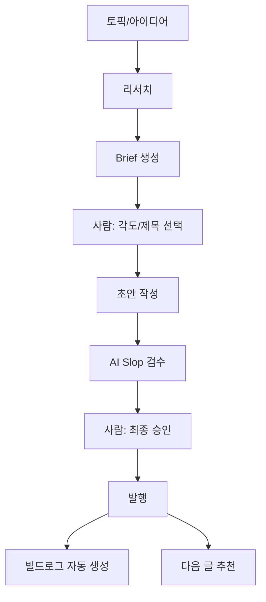
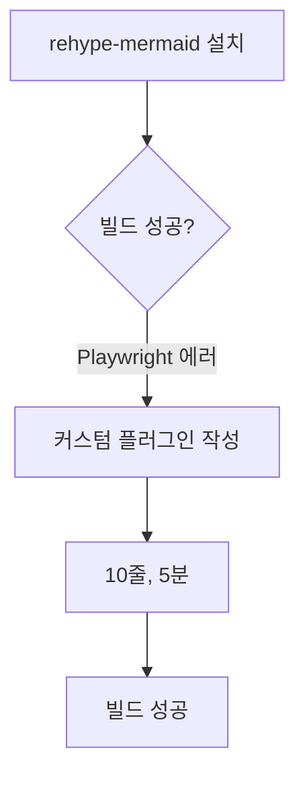

## 블로그는 완성했는데, 글이 없다

지난주에 블로그를 만들었다. Astro, MCP 서버, 디자인 시스템, RSS 피드, 한국어 날짜 포맷까지. 기술적으로는 꽤 그럴듯한 블로그가 나왔다.

문제는 글이 1개라는 거다.

`bun run new "제목"` 치면 빈 마크다운 파일이 생긴다. 거기서부터는 내가 알아서 해야 한다. 리서치도, 구조 잡기도, 톤 맞추기도, 검수도. 사이드 프로젝트에서 "알아서"는 "안 한다"의 다른 말이다.

그래서 파이프라인을 만들기로 했다. 글 한 편 쓰는 과정을 시스템으로.

## 처음 생각한 건 단순했다

Claude Code에 "이 주제로 글 써줘" 하면 되는 거 아닌가? 솔직히 그것도 된다. 근데 결과물이, 어떻게 말하면 좋을까, ChatGPT가 쓴 티가 난다.

4,200개 글을 16개월 동안 추적한 연구가 있다. 순수 AI가 쓴 콘텐츠는 평균 23% 낮은 검색 순위를 받았다. 반면 AI가 초안을 쓰고 사람이 제대로 편집한 글은? 사람이 직접 쓴 글과 4% 차이밖에 안 났다.

23% vs 4%. 차이를 만드는 건 사람의 개입이고, 내가 만들려는 건 그 개입이 자연스럽게 들어가는 구조다.

## Post Compiler라고 이름 붙였다

글쓰기를 컴파일한다는 개념이다. 원재료(토픽, 리서치)를 넣으면 중간 산출물(brief, 초안, 리뷰)을 거쳐 최종 결과물(발행된 글 + 빌드로그)이 나온다.

소프트웨어 빌드 시스템과 비슷하다. 소스코드를 컴파일러에 넣으면 바이너리가 나오듯, 아이디어를 Post Compiler에 넣으면 블로그 글이 나온다. 그리고 빌드 로그도 남는다.

핵심은 사람이 두 번 개입한다는 거다. Brief 단계에서 각도를 고르고, 초안 완성 후에 최종 승인한다. "AI가 알아서 다 해줘"가 아니라 "AI가 80%를 준비하고, 내가 20%의 판단을 한다."

## 실제로 만든 것들

### Run Artifact: 과정이 곧 기록

파이프라인을 한 번 실행하면 `.pipeline/runs/2026-03-31-claude-code/` 같은 폴더가 생긴다. 안에는:

| 파일 | 역할 |
|------|------|
| `run.json` | 실행 상태 매니페스트 (어디까지 진행했는지) |
| `research.md` | 리서치 결과 정리 |
| `brief.json` | 각도 옵션, 제목 옵션, concepts |
| `draft-v1.md` | 초안 (여러 버전 가능) |
| `review.json` | AI slop 검수 결과 |
| `recommendations.json` | 다음 글 추천 3개 |

이 구조가 좋은 이유는 두 가지다. 첫째, 세션이 끊겨도 `--resume`으로 이어서 할 수 있다. 둘째, 이 artifact 자체가 빌드로그 글의 원재료가 된다. 과정을 기록하려고 따로 노력할 필요가 없다. 파이프라인이 알아서 남긴다.

### Claude Code Skill: 자연어 오케스트레이터

파이프라인 로직을 TypeScript로 짜지 않았다. `.claude/commands/write-post.md`에 마크다운으로 작성했다. Claude Code skill이라는 건데, 쉽게 말하면 Claude Code에게 주는 작업 지시서다.

왜 코드가 아니라 자연어인가? 글이 5개도 안 되는 시점에서 rigid한 코드보다 유연한 에이전트 오케스트레이션이 낫다. 리서치 범위가 달라지거나, 검수 기준이 바뀌거나, 새로운 단계가 필요해질 때 마크다운 파일 하나만 수정하면 된다.

코드로 구현한 건 딱 두 가지만이다:
- `scripts/write-post/run.ts`: run artifact 생성/로드/업데이트
- `scripts/write-post/compile-build-log.ts`: run artifact를 빌드로그 글로 변환

상태 관리와 변환 같은 **결정적 동작**은 코드로, **유연한 판단**은 에이전트에게. 이 분업이 Phase 1A의 핵심 설계 결정이었다.

### AI Slop 검수: 한국어에서의 삽질

AI가 쓴 영어 글의 문제점은 잘 알려져 있다. "delve", "crucial", "landscape" 같은 단어들. 근데 한국어는 다른 패턴이다.

한국어 AI 텍스트 감지 연구(KatFish, 2025)에서 발견한 가장 강력한 신호는 **쉼표 사용 빈도**였다. AI가 쓴 한국어는 문장의 61%에 쉼표가 들어간다. 사람이 쓴 한국어는 26%. 영어 문장 구조를 그대로 가져오면서 쉼표가 과다하게 붙는 거다.

검수 리스트를 만들면서 제일 많이 걸린 패턴들:

| 번역체 패턴 | 자연스러운 한국어 |
|------------|----------------|
| ~함으로써 가능합니다 | ~하면 됩니다 |
| ~을 활용하여 | ~을 써서 |
| ~하는 것이 중요합니다 | ~안 하면 후회합니다 |
| 다음과 같습니다: [불릿] | 문장으로 풀어서 |
| 결론적으로 | _(쓰지 않음)_ |

이 리스트를 skill에 "금지 표현"으로 넣었다. 모델에게 "자연스럽게 써"라고 하는 것보다 "이건 쓰지 마"라고 하는 게 훨씬 효과적이다.

## Mermaid 다이어그램, 작은 삽질

글에 시각 요소가 필요했다. 텍스트만 있는 기술 블로그는 읽기 힘드니까. Mermaid 다이어그램이 답이었다. 마크다운 안에 코드블록으로 작성하면 알아서 렌더링된다.

`rehype-mermaid` 플러그인을 설치했다. 빌드가 터졌다. Playwright가 필요하단다. Cloudflare Pages 빌드 환경에서는 Chromium이 안 돌아간다.

결국 10줄짜리 커스텀 rehype 플러그인을 만들었다. mermaid 코드블록을 `<pre class="mermaid">`로 바꿔주는 게 전부다. 클라이언트에서 mermaid.js가 렌더링한다. 30분짜리 "설치"가 5분짜리 "직접 만들기"로 바뀐 순간.

교훈: 패키지가 안 되면 직접 만드는 게 빠를 때가 있다. 특히 하려는 게 단순할 때.

## 지금 읽고 있는 이 글이 첫 번째 실행 결과다

메타한 이야기지만, 이 글 자체가 Post Compiler의 첫 번째 실행이다. `.pipeline/runs/2026-03-31-claude-code/`에 이 글의 리서치, brief, 초안, 검수 결과가 다 들어있다.

파이프라인이 실제로 한 일:
1. MCP로 기존 글(ai-native-blog) 참조
2. AI 콘텐츠 파이프라인 현황 외부 리서치
3. 각도 3개 + 제목 6개 옵션 생성 → 내가 선택
4. 초안 작성 + AI slop 검수
5. 내가 최종 승인 + 발행

"글 써줘"와 다른 점은 두 번의 사람 개입이다. Brief에서 "이 각도로 가자"를 골랐고, 초안에서 "유머 톤을 유지해줘"를 지시했다. AI가 만든 옵션 중에서 내가 고르는 구조.

## 다음은 뭘 할 건가

지금은 글이 2개뿐이라 파이프라인의 진가가 안 나온다. 진짜 재미는 글이 5개, 10개 쌓이면서 시작된다.

- **concepts 그래프**: 글마다 frontmatter에 concepts가 있다. 이걸 그래프로 엮으면 "이 주제는 이미 다뤘고, 저 주제는 아직"이 보인다
- **novelty scoring**: 새 글의 concepts가 기존 그래프와 얼마나 겹치는지 계산. 중복이면 경고
- **reasoning trail**: MCP에 `get_post_process` 도구 추가. 외부 에이전트가 "이 글은 어떻게 만들어졌는지" 쿼리 가능

웹의 52%가 AI가 만든 콘텐츠라고 한다. 양의 문제는 이미 해결됐다. 남은 건 "이 글은 어떤 과정을 거쳐 나왔는가"를 증명하는 것. Post Compiler의 run artifact가 그 시작점이 될 수 있다고 생각한다.

아직 확신은 없다. 5개 더 써봐야 안다.
