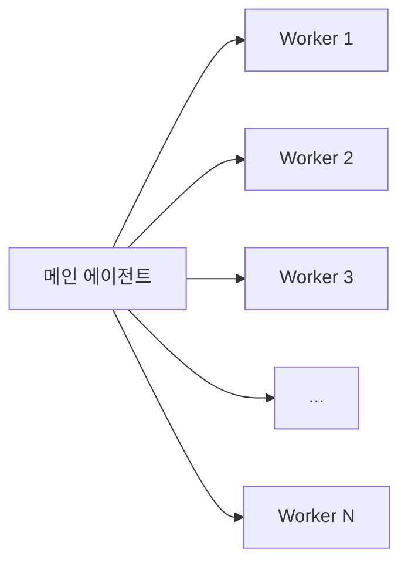
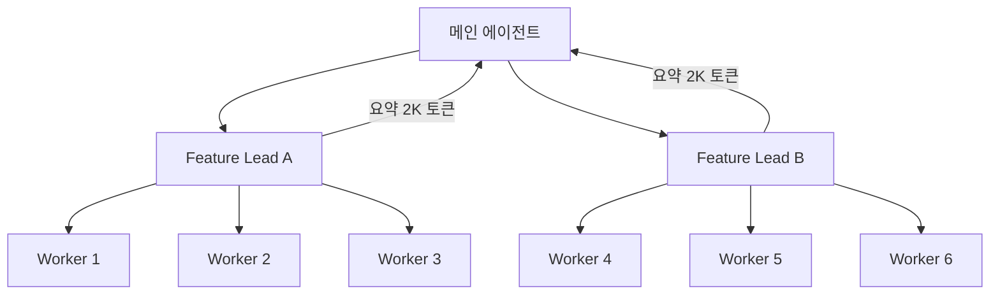

## 1,000개를 동시에 평가해야 했다

에이전트 런타임을 만들다 보면 이런 순간이 온다. 사용자의 요청 하나가 들어왔는데, 처리하려면 수백에서 수천 개의 요소를 각각 LLM으로 심층 평가해야 하는 상황.

내 경우에는 1,000개였다. 각 요소마다 5~6개의 평가 기준으로 점수를 매기고, 제외 조건을 확인하고, 우대 사항을 반영하고, 글로벌 규칙을 적용해서 최종 score와 세밀한 평가 근거를 생성해야 했다. 단순 분류가 아니라 심층 평가다. 순차적으로 돌리면 요소 하나에 3초, 1,000개면 50분. 사용자가 기다릴 시간이 아니다.

당연히 병렬로 돌렸다. 동시에 50개씩 배치로 던지니까 전체 처리 시간이 60초 근처로 줄었다. 여기까지는 좋았다.

문제는 그다음이었다. 1,000개의 평가 결과가 돌아왔다. 심층 평가라 각 결과가 평균 1,200토큰. 6개 criteria별 점수, 근거, 제외/우대 판정까지 포함하면 이 정도는 나온다. 합치면 1,200,000토큰. 1.2M. 메인 에이전트의 컨텍스트 윈도우가 200K인데 결과만으로 6배를 초과했다.

Fan-out은 쉬웠다. Fan-in에서 벽에 부딪혔다.

## 왜 fan-out은 쉬운가

병렬로 작업을 분배하는 건 사실 잘 풀린 문제다. 패턴도 명확하고 도구도 많다.

각 워커에게 동일한 프롬프트와 개별 요소를 넘기면 된다. Rate limiting만 신경 쓰면 구현은 간단하다. Promise.allSettled로 부분 실패도 처리되고, 배치 크기만 조절하면 API 제한도 넘기지 않는다.

OpenAI, Anthropic, LangChain, 어떤 프레임워크를 쓰든 fan-out 패턴은 기본 제공된다. Azure의 에이전트 디자인 패턴 문서에도, OpenAI Agents SDK에도 Orchestrator-Worker 패턴이 첫 번째로 나온다. "이렇게 하세요"가 명확하다.

근데 해보니까 달랐다. 진짜 문제는 결과가 돌아온 다음이다.

## Fan-in: 결과를 합치는 세 가지 벽

### 넣을 수가 없다

200K 컨텍스트 윈도우에 1,000개 결과(1.2M 토큰)를 넣을 수 없다. 6배 초과. 1M 컨텍스트를 써도 안 들어간다. 그럼 여러 번 나눠서? 토큰 비용이 입력 기준으로 $3/1M 토큰이라면 1.2M을 통째로 넣는 데만 $3.6. 하루 500번 호출하면 연간 $657K. 컨텍스트가 넓어졌다고 문제가 사라지는 게 아니다. 비용이 될 뿐이다.

### 넣어도 못 본다

그럼 비용을 감수하고 전부 넣으면? 성능이 안 나온다. "Lost in the Middle" 현상이다. LLM은 컨텍스트의 앞과 끝에 있는 정보에 편향적으로 주의를 기울이고, 중간은 흘려보낸다. 500번째 결과 근처에 핵심 정보가 있었다면? 묻힌다.

LangChain의 2026 State of Agent Engineering 보고서에 인상적인 숫자가 있다. 토큰 사용량이 에이전트 성능 분산의 80%를 설명한다고. 컨텍스트에 뭘 넣느냐가 곧 에이전트가 얼마나 잘 동작하느냐다.

### 형태가 제각각이다

마지막 벽은 의외로 실전에서 많이 부딪히는 문제다. 워커들이 반환하는 결과의 형태가 일관되지 않는다. 같은 프롬프트를 줘도 어떤 워커는 3줄로 요약하고, 어떤 워커는 15줄짜리 분석을 내놓는다. JSON 스키마로 강제해도 내용의 깊이가 들쑥날쑥하다. 이 불균일한 결과를 하나의 일관된 판단으로 합쳐야 한다.

세 벽을 동시에 넘어야 한다. 용량 안에 넣되, 중요한 정보가 묻히지 않고, 일관된 구조로. 이게 fan-in 문제의 본질이다.

## 컨텍스트 윈도우는 예산이다

이 문제를 풀면서 프레이밍을 바꿨다. 컨텍스트 윈도우를 "넣을 수 있는 공간"이 아니라 **예산**으로 보기 시작했다.

회사 예산을 생각해보면 감이 온다. 예산이 있으면 부서마다 "우리 팀에 더 달라"고 한다. 마케팅도, 엔지니어링도, 인프라도 전부 중요하다고 주장한다. 근데 한도가 있으니까 우선순위를 정해야 한다. "다 중요하다"는 "아무것도 우선이 아니다"와 같은 말이다.

컨텍스트 윈도우도 똑같다. 시스템 프롬프트가 자리를 차지하고, 대화 히스토리가 자리를 먹고, 도구 결과가 들어와야 하고, 이전 추론 결과도 유지해야 한다. 여기에 fan-in 결과 1.2M이 들어오겠다고 한다. 뷔페에서 접시에 음식을 산더미로 쌓는다고 다 소화가 안 되듯이, 컨텍스트도 넣는다고 다 처리가 안 된다.

Anthropic의 Context Engineering 가이드가 이 관점을 잘 정리했다. 컨텍스트 윈도우를 희소 자원(scarce resource)으로 취급하고, 모델이 high-signal 토큰에만 집중하도록 설계하라고 한다. Weaviate도 비슷한 이야기를 한다. "context engineering is about designing everything around this scarce resource."

예산 프레이밍을 받아들이면 질문이 바뀐다. "어떻게 다 넣지?"에서 "뭘 버릴지 어떻게 고르지?"로. 이 전환이 생각보다 어렵다. 엔지니어는 정보를 버리는 걸 본능적으로 싫어하니까. 근데 안 버리면 성능이 망가진다.

## 실전에서 쓰는 네 가지 패턴

### 패턴 1: 구조화된 요약 강제

가장 단순한 접근. 워커 프롬프트에서 출력 형태를 엄격하게 제한한다.

1,000개 결과가 각각 1,200토큰이면 1.2M. 각 결과를 "관련 여부(boolean) + 점수(0-100) + 한 줄 근거"로 제한하면 결과당 50토큰, 총 50K. 200K 컨텍스트의 25%까지 줄어든다.

효과적이지만 함정이 있다. 워커가 발견한 뉘앙스가 한 줄 근거에 담기지 않을 때가 있다. "이 요소는 단독으로는 관련 없는데, 요소 #47과 결합하면 의미가 생긴다" 같은 판단이 잘린다. 압축하면 정보가 사라진다. 당연하지만 간과하기 쉬운 트레이드오프다.

### 패턴 2: Observation Masking

JetBrains Research가 2025년 12월에 발표한 연구에서 제안한 접근이다. 도구 호출 결과(observation)를 선택적으로 마스킹하거나 압축한다.

원리는 간단하다. 모든 결과를 메인 에이전트에 보여주는 대신, 결과를 세 등급으로 나눈다.

- **Pass-through**: 점수 상위 10%. 원문 그대로 전달
- **Summary**: 점수 중간 60%. 한 줄 요약으로 압축
- **Drop**: 점수 하위 30%. 메타데이터만 남기고 내용 제거

이 연구의 핵심 발견이 하나 있다. 기본은 Observation Masking을 쓰고, 컨텍스트가 임계점(예: 80%)에 도달했을 때만 LLM 요약을 트리거하는 하이브리드 전략이 가장 효율적이라는 것. LLM 요약은 정확하지만 느리고 비싸다. 매번 쓸 필요 없다.

### 패턴 3: 계층적 위임

Addy Osmani가 정리한 멀티에이전트 코딩 패턴에서 인상적인 숫자가 하나 있다. 메인 에이전트가 6개 subagent를 직접 관리하는 대신, 2개의 feature lead를 두고 각 lead가 3개 subagent를 관리하면, 같은 작업을 하면서 컨텍스트 효율이 3배 높아진다.

메인 에이전트가 받는 건 feature lead 2개의 요약뿐이다. 4K 토큰. 6개 워커의 raw 결과 대신.

내 1,000개 문제에 적용하면? 20개 리드를 두고 각 리드가 50개 워커를 관리한다. 각 리드가 50개 결과를 소화해서 2K 토큰 요약을 올린다. 메인 에이전트가 받는 건 40K 토큰. 1.2M에서 40K로, 97% 감소.

대가가 있다. 리드 에이전트 20개를 추가로 호출해야 하니까 API 비용이 늘고, 전체 latency도 한 단계 더 붙는다. 그래도 메인 에이전트의 판단 품질이 확연히 올라간다. 이 비용은 아깝지 않았다.

### 패턴 4: 점진적 통합

결과를 한꺼번에 합치지 않고 스트리밍으로 처리한다. 워커 결과가 돌아올 때마다 메인 에이전트의 "running summary"를 업데이트하는 방식.

누적 요약이 있고, 새 결과가 도착하면 "기존 요약 + 새 결과"를 합쳐서 업데이트된 요약을 만든다. MapReduce의 reduce 단계와 비슷하다.

장점은 메모리 사용량이 일정하다는 것. 1,000개가 오든 10,000개가 오든 running summary의 크기는 변하지 않는다. 단점은 LLM 호출이 결과 개수만큼 늘어난다는 것. 1,000개면 reduce 호출이 1,000번. 순차적이라 병렬화도 안 된다. 비용과 시간의 트레이드오프가 극단적이라서 정말 대규모이고 순서가 중요하지 않은 경우에만 고려할 만하다.

## 로컬과 원격은 다른 게임이다

여기까지 패턴을 정리하면서 하나 더 깨달은 게 있다. 같은 fan-in 문제라도 에이전트가 어디서 돌아가느냐에 따라 전략이 완전히 달라진다.

Claude Code 같은 로컬 에이전트를 생각해보자. 파일 읽기는 디스크 I/O다. 10ms도 안 걸린다. 토큰 비용도 없다. 그래서 "일단 읽고 판단"이 가능하다. Grep으로 코드베이스 전체를 훑고, 관련 파일을 10개 읽고, 그중에 쓸 만한 3개를 골라도 비용이 거의 0이다.

원격 에이전트 런타임에서는 이야기가 다르다. 도구 호출 하나가 네트워크 왕복 + API 토큰 비용이다. "일단 읽고 판단"이 아니라 "읽기 전에 뭘 읽을지 계획"해야 한다. 탐색적 접근이 사치가 된다.

이 차이가 아키텍처를 바꾼다. 로컬에서는 flat fan-out + 구조화된 요약(패턴 1)으로 충분한 문제가, 원격에서는 계층적 위임(패턴 3)이 필수가 된다. 도구 호출 자체가 비싸니까 호출 횟수를 줄이는 게 최적화의 첫 번째 축이 된다.

실전에서 내가 쓰는 규칙은 간단하다. 로컬이면 도구를 자유롭게 써서 컨텍스트를 풍부하게 모으고, 원격이면 도구 호출 전에 "이 호출이 컨텍스트 예산 대비 얼마의 정보 가치를 가져오는가"를 먼저 따진다. 같은 문제, 다른 경제학.

## 아직 안 풀린 것들

솔직하게 고백하면, 위의 패턴들을 조합해도 완벽하지 않다. 아직도 최적화 중이고, 답이 안 보이는 부분이 있다.

계층적 위임에서 feature lead가 "중요하지 않다"고 판단해서 버린 정보가 실은 메인 에이전트에게 결정적이었던 경우가 있었다. 개별로 보면 평범한 두 요소가 같이 놓고 보면 의미가 생기는 건데, 서로 다른 리드에 배정되어서 그 연결이 끊긴 것. 어떤 정보를 어떤 리드에 배정하느냐, 이 라우팅 문제 자체가 또 하나의 LLM 판단을 필요로 한다. 닭과 달걀이다.

가끔 이런 생각이 든다. 이게 파일 시스템이 있는 로컬 에이전트였다면 훨씬 수월했을 거라고. 1,000개 평가 결과를 JSON 파일로 쓰고, 필요할 때 읽고, 인덱싱하고, 쿼리하면 된다. 컨텍스트 윈도우에 다 넣을 필요가 없다. 근데 원격 런타임에는 파일 시스템이 없다. 모든 상태가 컨텍스트 안에 있거나 사라진다. 이 제약이 문제를 근본적으로 어렵게 만든다.

Observation Masking의 "점수 기반 필터링"도 완전하지 않다. 점수를 매기는 기준이 메인 에이전트의 최종 목표와 정확히 정렬되어야 하는데, 이 정렬을 보장하기가 생각보다 어렵다. 결국 메타 프롬프트를 만들게 되고, 그 메타 프롬프트가 또 컨텍스트를 먹는다.

LangChain 보고서의 숫자가 머릿속에 남는다. 57%의 조직이 에이전트를 프로덕션에 배포했지만, 품질이 최대 장벽이라고 답했다. 89%가 관측 도구를 구현했다는 건 "돌아가는데 왜 이렇게 돌아가는지 모르겠다"는 상태에 가깝다는 뜻일 거다.

컨텍스트 예산 문제는 컨텍스트 윈도우가 무한해져도 사라지지 않는다. Magic의 100M 토큰 컨텍스트도, Llama 4 Scout의 10M 토큰도, 창이 넓어지면 넣고 싶은 것도 늘어난다. 예산은 항상 부족하다. 부족한 예산을 어떻게 쓸지 고르는 게 에이전트 엔지니어의 일이고, 그 판단을 시스템으로 만드는 게 런타임의 일이다.

아직 완전히 풀린 건 아니다. 근데 최소한, 문제가 뭔지는 이제 안다.
