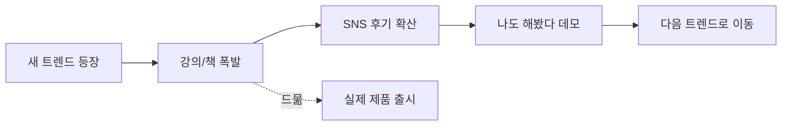

## 한국이 AI 도구를 세계에서 제일 열심히 쓴다. 근데 뭘 만들었나?

트위터를 열면 바이브코딩 후기가 넘친다. 유튜브에는 "클로드 코드 완벽 가이드" 영상이 쏟아진다. 서점에서는 바이브코딩 책이 3쇄 찍고 IT 분야 1위를 달린다[^1].

숫자로 보면 한국의 AI 도구 열광은 진짜다. Claude Code 주간 활성 사용자가 4개월 만에 6배 성장했고, 세계에서 Claude를 가장 많이 쓰는 개인이 한국 개발자다[^2]. Anthropic이 아태 세 번째 오피스를 서울에 열 정도로 이 시장은 뜨겁다[^2].

근데 한 가지 질문이 계속 걸린다. 이 열광으로 뭘 만들었는가?

SNS를 스크롤해보면 보이는 건 강의 링크, 수강 후기, "나도 해봤다" 데모 스크린샷이다. 실제로 사용자를 모으고, 결제를 받고, 돈을 버는 제품? 찾기 어렵다.

## 그 사이 해외에서는

브라질의 마케터 Sabrine Matos는 개발 경험이 없다. Lovable이라는 바이브코딩 도구로 45일 만에 여성 안전 앱 Plinq을 만들었다. 사용자 10,000명, 연 매출 $456K[^3]. 런던의 Sebastian Volkis도 비개발자다. Claude와 GPT로 고객지원 챗봇 ChatIQ를 만들었다. 사용자 11,000명[^3].

이 사례들이 특이한 게 아니다. 2026년 초 기준으로 바이브코딩 활성 사용자의 63%가 비개발자라는 분석이 있다[^4]. 파운더, PM, 마케터가 직접 만들고 있다. 22살에 대학을 그만둔 Evan은 AI 일러스트 도구를 만들어 월 $1,700을 번다[^3]. Pieter Levels는 3시간 만에 비행 시뮬레이터를 만들어 월 $12K를 벌고 있다[^3].

한국은 이 도구들을 그 누구보다 많이 쓰면서, 이런 이야기가 안 들린다. 왜?

## 이건 새로운 현상이 아니다

솔직히 이 패턴을 보면서 기시감이 들었다.

2020년, 코로나가 터지면서 스마트스토어였다. 두 달 만에 점포 6만 5천 개가 새로 열렸고[^5], "퇴근 후 스마트스토어로 월 200만 원 더 버는 비밀" 강의가 쏟아졌다. 수강생은 몰렸다. 근데 그 강의를 듣고 실제로 월 200만 원을 번 사람보다, 강의를 파는 사람이 더 많이 벌었다.

2021~2022년에는 구매대행이었다. 그다음은 유튜브 성장 강의였다. 대상만 바뀌었지 구조는 똑같다. 새로운 돈 되는 것이 등장하면 한국 시장은 놀라운 속도로 반응한다 — 근데 반응의 형태가 "만들기"가 아니라 "배우기"다.

에듀테크 시장이 10조 원에 달하고 패스트캠퍼스 혼자 연 매출 1,276억 원을 찍는 나라다[^6]. "가르치기"가 "만들기"보다 확실하게 돈이 되는 시장 구조가 이미 갖춰져 있다. 바이브코딩도 그 구조 안에 흡수되고 있는 건 아닌지 의심이 든다.

배우는 것에서 멈추고, 만드는 것으로 넘어가지 못하는 패턴이 반복되고 있다.

## Stripe가 없는 나라에서 인디해커 하기

여기서 잠깐. "한국인이 안 만드는 건 성향 문제"라고 결론 내리기 전에 환경을 봐야 한다.

미국에서 사이드프로젝트로 돈을 벌려면 이렇다. Stripe 가입 — 5분. 결제 연동 — API 키 복사, 10분. 끝. 내일부터 결제받을 수 있다.

한국에서 같은 걸 하려면? 먼저 사업자등록을 해야 한다. 그다음 PG사에 가입 신청을 한다. PG사가 서비스를 심사한다. 통과하면 결제 페이지에 상호명, 사업자등록번호, 대표자명, 사업장 주소, 전화번호를 상시 노출해야 한다. 휴대폰 번호는 안 된다. 자체 PG를 등록하려면 자본금 10억 원 이상에 전산 전문인력 5명 이상이 필요하다[^7].

주말에 바이브코딩으로 뭔가 만들고 월요일부터 결제받겠다? 한국에서는 불가능하다.

이 격차가 어떤 결과를 만드는지 생각해보면 답이 보인다. 해외 인디해커는 "만들고 → 바로 팔고 → 피드백 받고 → 개선"하는 사이클을 일주일 안에 돌린다. 한국에서는 "만들고 → 사업자등록하고 → PG 심사 기다리고 → 한 달 후에 결제 연동하고" — 그 사이에 동기가 식는다.

## 앱인토스가 증명한 것

근데 여기서 반전이 하나 있다.

토스의 앱인토스 플랫폼에서 비개발자 한 명이 2개월 만에 앱 21개를 출시하고 수익을 내기 시작했다. 제미나이로 아이디어를 구상하고, Lovable로 개발하고, Claude Code로 마무리했다. 첫 수익은 700원이었지만 매달 늘어서 "중요한 수익 파이프라인"이 됐다고 한다[^8].

핵심이 뭐냐면 — 이 사람이 가능했던 건 토스가 결제, 배포, 마케팅 장벽을 전부 해결해줬기 때문이다. 사업자등록? 토스가 대행한다. PG 연동? 플랫폼에 내장되어 있다. 사용자 확보? 토스 앱 안에 이미 수천만 유저가 있다.

환경이 바뀌자 한국인도 만들기 시작했다. 성향의 문제가 아니었다.

이게 중요한 신호다. 만들 사람은 있는데 "만들고 바로 팔 수 있는" 인프라가 없었던 거다. 인프라가 생기자 제품도 나왔다.

## 열광 다음에 와야 할 것

솔직히 나도 이 글을 쓰면서 찔린다. 블로그를 만들면서 기술 스택 고르고, 디자인 시스템 잡고, 콘텐츠 파이프라인 만들고 — 정작 글은 4개 썼다. 만드는 과정에 빠져서 만드는 것 자체를 잊는 건 나도 마찬가지다.

한국의 Claude Code 열풍은 에너지가 진짜라서 아깝다. 6배 성장하는 시장, 세계 1위 사용자를 배출하는 커뮤니티, 책이 3쇄 찍히는 관심도. 인프라는 바뀌고 있다. 앱인토스가 그 시작이고, 토스페이먼츠 같은 플랫폼이 장벽을 낮추고 있다. 근데 이 에너지가 강의 소비에서 끝나면 2년 뒤에는 "바이브코딩? 아 그거 한때 유행했지"가 된다. 스마트스토어가 그랬듯이.

이 에너지가 제품으로 바뀌면? 한국어권에서만 통하는 틈새 SaaS가 나올 수 있다. 한국 규제를 뼈저리게 아는 사람이 만든 도구가 나올 수 있다. 도구는 이미 충분하다. 열광도 충분하다. 부족한 건 "뭘 만들었나"라는 질문을 던지는 사람이다.

다음에 바이브코딩 강의 광고가 보이면, 그 강의를 만든 사람에게 물어봐야 할 질문이 있다. "이 도구로 당신은 강의 말고 뭘 만들었습니까?"

[^1]: [고시위크 — 클로드 코드 완벽 가이드 초판 품절·3쇄](https://www.gosiweek.com/article/1065597368055328)
[^2]: [Anthropic — Seoul becomes third office in Asia-Pacific](https://www.anthropic.com/news/seoul-becomes-third-anthropic-office-in-asia-pacific)
[^3]: [Everyday AI Blog — 5 Vibe Coded Apps Making Real Money](https://everydayaiblog.com/vibe-coded-apps-real-revenue-users/)
[^4]: [Solveo — Reddit 1,000명 분석, via Everyday AI Blog](https://everydayaiblog.com/vibe-coded-apps-real-revenue-users/)
[^5]: [전자신문 — 네이버 '스마트스토어' 창업 열풍, 두 달간 6만5000개 점포 개설](https://m.etnews.com/20200605000165)
[^6]: [한국강사신문 — 패스트캠퍼스 연 매출 1,276억 원](https://www.lecturernews.com/news/articleView.html?idxno=182503)
[^7]: [PortOne — PG 계약 요건 및 전자금융업 등록 기준](https://guide.portone.io/)
[^8]: [토스 앱인토스 블로그 — 비개발자 2개월 21개 앱 출시 후기](https://toss.im/apps-in-toss/blog/robin-26-3-13)
