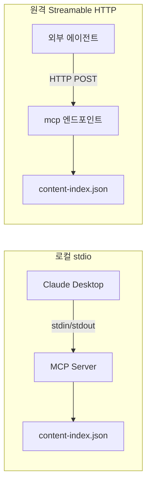

## 에이전트가 내 블로그를 읽게 하고 싶었다

블로그를 만들면서 하나 걸리는 게 있었다. 사람은 브라우저로 글을 읽는다. 근데 AI 에이전트는? RSS를 파싱할 수도 있고, 웹 크롤링을 할 수도 있지만, 둘 다 비구조적이다. 에이전트가 "이 블로그에서 Context Window 관련 글 찾아줘"라는 요청을 받으면, HTML을 긁어서 텍스트를 추출하고, 어떤 게 제목이고 어떤 게 본문인지 추측해야 한다.

MCP(Model Context Protocol)를 알게 된 건 2024년 11월이었다. Anthropic이 오픈소스로 공개한 프로토콜인데, 핵심은 간단하다. AI 에이전트가 외부 시스템의 도구를 호출할 수 있는 표준 인터페이스. 데이터베이스든 API든 파일시스템이든, MCP 서버로 감싸면 에이전트가 쓸 수 있다.

그래서 블로그에 달아봤다. 에이전트가 글 목록을 조회하고, 키워드로 검색하고, 특정 글의 전문을 구조화된 JSON으로 받아갈 수 있게. 2026년 3월에 시작해서 일주일 정도 걸렸다.

결론부터 말하면, 기술적으로는 동작한다. 에이전트 사용자는 아직 0명이다.

## 도구 7개를 설계하는 데 가장 오래 걸린 건 "몇 개로 할까"였다

MCP 서버의 핵심은 도구(tool)다. 에이전트가 호출할 수 있는 함수 목록. 처음에는 단순했다. 글 목록 조회, 글 상세 조회, 검색. 3개면 충분하다고 생각했다.

근데 만들다 보니 늘어났다. "자연어 질문"을 받는 `ask_blog`가 먼저 추가됐고, concepts 그래프를 탐색하는 `explore_concepts`도 생겼다. 다음에 쓸 토픽을 추천하는 `recommend_topic`, 독자(에이전트)가 토픽을 제안하는 `suggest_topic`까지. 처음 3개로 끝내려던 게 7개가 됐다.

최종 7개:

```
list_posts      — 글 목록 (태그 필터, 개수 제한)
get_post        — 글 상세 (구조화된 JSON)
search_posts    — 키워드 검색
ask_blog        — 자연어 질문 (키워드 매칭 기반)
explore_concepts — concepts 그래프 탐색
recommend_topic — 다음 글감 추천 (novelty scoring)
suggest_topic   — 독자→작성자 토픽 제안
```

7개가 많은 걸까? MCP 생태계 기준으로 보면 적은 편이다. 평균적인 MCP 서버가 10-15개 도구를 노출한다. 근데 여기서 트레이드오프가 있다.

에이전트가 MCP 서버에 연결하면, 사용 가능한 도구 목록이 LLM의 컨텍스트에 들어간다. 도구 하나당 이름, 설명, 파라미터 스키마가 포함되니까 도구 7개면 대략 500-800토큰. 도구가 20개면 2,000토큰 가까이 된다. 매 요청마다. 에이전트가 100번 호출하면 도구 목록만으로 200K 토큰을 소비한다.[^1]

그래서 "이 도구가 정말 필요한가"를 계속 물어봤다. `ask_blog`는 `search_posts`와 겹치는 것 같지만, 에이전트 입장에서 "MCP 서버가 뭐하는 곳이야?"라고 물을 때 검색 쿼리를 직접 만드는 것보다 자연어로 던지는 게 자연스럽다. 남겼다.

`suggest_topic`은 고민이 많았다. 에이전트가 "이 블로그에 이런 글이 있으면 좋겠어요"라고 제안하는 기능인데, 현실적으로 이걸 호출할 에이전트가 있을까? 아직 없다. 그래도 남겼다. 에이전트와 블로그 작성자 사이의 피드백 루프가 MCP의 진짜 가치라고 생각해서.

## Transport: 로컬과 원격은 완전히 다른 문제다

MCP에는 두 가지 공식 transport가 있다. stdio와 Streamable HTTP.



**stdio**는 간단하다. 클라이언트(Claude Desktop 같은)가 MCP 서버를 subprocess로 띄우고, stdin/stdout으로 JSON-RPC 메시지를 주고받는다. 내 구현은 11줄이다:

```typescript
import { StdioServerTransport } from '@modelcontextprotocol/sdk/server/stdio.js';
import { createMcpServer } from './server.js';

async function main() {
  const server = createMcpServer();
  const transport = new StdioServerTransport();
  await server.connect(transport);
}
main().catch(console.error);
```

이게 전부다. `createMcpServer()`가 도구 7개를 등록한 서버를 반환하고, stdio transport에 연결하면 끝.

**Streamable HTTP**는 다른 세계다. 서버가 독립 프로세스로 돌면서 HTTP 엔드포인트를 노출한다. 여러 클라이언트가 동시에 연결할 수 있고, 인증도 붙일 수 있다. 2025년 3월에 기존 SSE transport를 대체했다.

내 경우엔 Cloudflare Workers 위에 Astro의 API Route로 구현했다. 근데 여기서 설계 결정이 하나 필요했다.

## Stateless로 갈 수밖에 없었던 이유

MCP 스펙은 기본적으로 stateful 세션을 가정한다. 클라이언트가 연결하면 세션이 생기고, 세션 안에서 여러 도구를 호출한다. 서버 측에 세션 상태가 남는다.

프로덕션에서 이게 문제가 된다. Cloudflare Workers는 요청 간에 상태를 유지하지 않는다. 로드밸런서 뒤에 여러 인스턴스가 뜨는 환경에서는 세션 상태를 어딘가에 저장해야 한다. Redis? KV? 개인 블로그에?

그래서 완전히 stateless로 갔다:

```typescript
export const POST: APIRoute = async ({ request }) => {
  const server = createServer();
  const transport = new StreamableHTTPServerTransport({
    sessionIdGenerator: undefined  // 세션 없음
  });
  await server.connect(transport);
  const body = await request.text();
  const response = await transport.handleRequest(request, body);
  await server.close();
  return response;
};
```

요청마다 서버를 새로 만들고, 처리하고, 닫는다. `sessionIdGenerator: undefined`가 핵심이다. 세션을 아예 생성하지 않겠다는 선언.

이게 맞는 선택이었을까? 트레이드오프가 있다.

**장점:**
- Cloudflare Workers에서 그냥 돌아간다. 상태 저장소 불필요.
- 수평 확장에 제약 없음.
- 구현이 단순하다. 세션 만료, 정리, 복구 로직 전부 필요 없음.

**단점:**
- 에이전트가 "아까 검색한 결과에서 두 번째 글 보여줘"를 못 한다. 매 요청이 독립적이라 이전 컨텍스트가 없다.
- `suggest_topic`으로 쌓인 제안이 요청이 끝나면 사라진다. (인메모리 배열이라서.)

`suggest_topic` 데이터 유실은 알려진 문제다. TODOS.md에 "Cloudflare KV로 영속화" 항목이 적혀 있다. 근데 아직 트래픽이 0이라 급하지 않다.

## stdio와 HTTP의 도구 개수가 다르다

만들다가 발견한 건데, stdio 서버에는 도구가 7개고 HTTP 엔드포인트에는 5개다. `explore_concepts`와 `recommend_topic`이 HTTP 쪽에 빠져있다.

의도적이었다. 아니, 정확히는 의도적으로 바뀌었다. 처음에는 동일하게 7개였는데, concepts 그래프와 추천 엔진이 `content.ts`가 아닌 별도 모듈(`recommend.ts`)에 있다. HTTP 엔드포인트(`src/pages/mcp.ts`)에서 이 모듈을 import하면 Cloudflare Workers 번들 크기가 커지고, 빌드 의존성이 복잡해진다.

로컬 stdio 서버는 전체 코드베이스에 접근할 수 있으니 7개 전부 노출하고, 원격 HTTP는 핵심 5개만 노출하는 걸로 정리했다. transport에 따라 도구 세트가 달라지는 건 MCP 스펙에서 허용하는 패턴이다. 서버가 `tools/list`로 사용 가능한 도구를 알려주니까 클라이언트는 동적으로 적응한다.

근데 이게 좋은 패턴인지는 모르겠다. 같은 이름의 MCP 서버인데 연결 방식에 따라 할 수 있는 게 다르면, 에이전트 입장에서 혼란스러울 수 있다. 나중에 HTTP 쪽도 7개로 맞출 생각이다.

## 800만 다운로드, 5,800개 서버, 그리고 내 방문자 0명

MCP 생태계는 빠르게 커지고 있다. 2024년 11월 오픈소스 이후 18개월 만에 서버 다운로드 800만 건을 넘겼다. 서버 5,800개, 클라이언트 300개 이상.[^2] Microsoft Azure, Google Cloud가 공식 지원하고, Gartner는 2026년까지 API gateway 75%가 MCP를 지원할 거라 예측한다.[^3]

근데 이 숫자들과 내 블로그의 현실 사이에는 간극이 있다.

MCP 서버를 만드는 건 점점 쉬워지고 있다. 문제는 "누가 연결하느냐"다. 현재 MCP 클라이언트는 대부분 개발 도구다. Claude Desktop, Cursor, VS Code 확장. 이 도구들은 개발자의 로컬 환경에서 돌아가고, 주로 코드 관련 MCP 서버(GitHub, 파일시스템, 데이터베이스)에 연결한다.

개인 블로그의 MCP 서버에 연결할 일반 사용자? 아직 그런 유스케이스가 성립하려면 "에이전트가 웹을 탐색하면서 관심 있는 블로그의 MCP 서버를 자동으로 발견하고 연결하는" 흐름이 필요하다. MCP 2026 로드맵에 서버 디스커버리가 포함되어 있긴 하지만,[^4] 아직 스펙 단계다.

그래서 지금 내 MCP 서버의 가치는 외부 독자가 아니라 나 자신에게 있다. `/write-post` 파이프라인이 새 글을 쓸 때 `search_posts`로 기존 글을 탐색하고, `recommend_topic`으로 다음 글감을 추천받는다. MCP 서버의 첫 번째 사용자가 내 글쓰기 도구라는 건 좀 아이러니하지만, 실제로 유용하다.

## 프로덕션에서 만나는 함정 3가지

MCP 서버를 "만드는" 건 쉽다. @modelcontextprotocol/sdk가 대부분의 복잡성을 숨겨준다. 프로덕션에 "올리는" 건 다른 문제다.

**1. 에러가 조용히 사라진다**

MCP의 에러 처리는 JSON-RPC 기반이다. 도구 호출이 실패하면 `isError: true`와 에러 메시지를 반환한다. 근데 LLM은 이 에러를 받아서 "사용자에게 다시 시도하라고 말하기"도 하고, 조용히 무시하고 다음 도구를 호출하기도 한다. 에이전트의 판단에 달렸다.

내 서버에서 `get_post`에 존재하지 않는 slug를 넘기면:

```typescript
if (!post) {
  return {
    content: [{ type: 'text', text: `글을 찾을 수 없습니다: ${slug}` }],
    isError: true
  };
}
```

이게 에이전트에게 전달되는데, 에이전트가 이걸 어떻게 처리할지는 내가 제어할 수 없다. 서버 로그에도 에러가 안 남는다. Cloudflare Workers에서 `console.error`를 해야 하는데, 정상적인 "not found" 응답과 진짜 서버 에러를 구분해서 로깅하는 건 별도 작업이다.

**2. 도구 설명이 곧 프롬프트다**

도구의 `description` 필드가 생각보다 중요하다. 이 문자열이 LLM의 컨텍스트에 들어가서 "이 도구를 언제 쓸지" 결정하는 근거가 된다.

처음에 `search_posts`의 설명을 "글을 검색합니다"로 적었더니, 에이전트가 제목을 알 때도 검색부터 했다. "키워드 또는 태그로 글을 검색합니다"로 바꾸니까, slug를 아는 경우엔 `get_post`를 직접 호출하게 됐다.

한국어로 적는 게 맞는지도 고민이다. Claude는 한국어를 잘 이해하지만, 다른 LLM 기반 에이전트가 연결하면? 도구 설명을 영어로 바꿔야 하나? 지금은 한국어로 두고 있다. 블로그 자체가 한국어니까.

**3. 콘텐츠 인덱스의 빌드 타임 생성**

내 MCP 서버는 `content-index.json`이라는 파일을 읽어서 글 데이터를 제공한다. 이 파일은 빌드 시점에 모든 마크다운 파일을 파싱해서 생성된다.

```bash
# package.json의 prebuild 스크립트
"prebuild": "bun run scripts/build-content-index.ts && bun run scripts/build-concepts-graph.ts"
```

장점은 런타임에 파일시스템이나 DB를 읽을 필요가 없다는 것. JSON 파일 하나를 메모리에 올리면 끝이라 Cloudflare Workers의 제약(실행 시간, 외부 연결)에 딱 맞는다.

단점은 글을 새로 쓰면 빌드를 다시 해야 MCP 서버에 반영된다는 것. Git push → Cloudflare Pages 자동 빌드 파이프라인이 있으니까 실제로는 커밋하면 2-3분 후에 반영된다. 실시간은 아니지만 블로그에 실시간이 필요한 건 아니다.

## 만들어보니 알게 된 것

MCP를 블로그에 달면서 배운 건, 프로토콜 자체보다 "에이전트를 위한 인터페이스 설계"라는 사고방식이다.

사람을 위한 UI는 시각적 계층, 네비게이션, 반응형 레이아웃을 고민한다. 에이전트를 위한 인터페이스는 다른 걸 고민해야 한다. 도구 이름만 보고 뭘 하는 건지 알 수 있어야 하고, 에러가 났을 때 에이전트가 다음에 뭘 해야 하는지 메시지가 안내해야 한다. 반환 데이터는 당연히 구조화되어 있어야 하고.

이걸 AX(Agent Experience)라고 부르는 사람들이 있다. UX의 에이전트 버전. 나도 그 방향이 맞다고 생각한다.

실제로 도구를 설계할 때 가장 많이 한 질문은 "에이전트가 이 도구를 처음 보면 뭘 할까?"였다. `list_posts`를 먼저 호출해서 전체 그림을 파악할까? 아니면 `search_posts`로 원하는 걸 바로 찾을까? `ask_blog`라는 자연어 인터페이스가 있으면 나머지 도구를 안 쓸까?

답은 아직 모른다. 사용자가 0명이니까 데이터가 없다.

그래도 한 가지 확실한 건, MCP 서버를 만드는 건 2026년 기준으로 진입 장벽이 낮다. @modelcontextprotocol/sdk의 `McpServer` 클래스에 `server.tool()`로 도구를 등록하면 된다. Zod로 파라미터 스키마를 정의하고, 핸들러 함수를 작성하면 끝. 나머지는 SDK가 해준다.

어려운 건 "뭘 만들까"다. 어떤 도구를, 몇 개, 어떤 granularity로 노출할지. 그리고 만든 다음에 "누가 쓸까"다.

이 블로그의 MCP 서버는 아직 아무도 안 쓴다. 근데 괜찮다. 에이전트가 웹을 읽는 방식이 바뀌고 있고, 그때 준비돼 있으려면 지금 만들어봐야 한다. 프로토콜을 읽는 것과 서버를 만들어보는 건 이해의 깊이가 다르다.

다음엔 이 MCP 서버를 Cloudflare Workers에 제대로 배포하고, "Add to Claude" 원클릭 버튼을 달아볼 생각이다. 사용자가 0명에서 1명이 되는 순간이 제일 어렵다고 하던데, 에이전트 사용자도 마찬가지일 것 같다.

[^1]: [Everything Wrong with MCP — Shrivu Shankar](https://blog.sshh.io/p/everything-wrong-with-mcp)
[^2]: [A Year of MCP: From Internal Experiment to Industry Standard — Pento](https://www.pento.ai/blog/a-year-of-mcp-2025-review)
[^3]: [MCP Enterprise Adoption Guide — Deepak Gupta](https://guptadeepak.com/the-complete-guide-to-model-context-protocol-mcp-enterprise-adoption-market-trends-and-implementation-strategies/)
[^4]: [The 2026 MCP Roadmap — Model Context Protocol Blog](https://blog.modelcontextprotocol.io/posts/2026-mcp-roadmap/)
