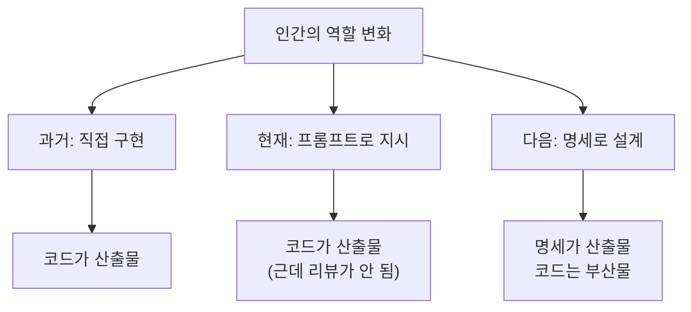

## 800줄을 만들었는데 읽을 수가 없다

에이전트에게 기능 하나를 시켰다. "사용자 프로필 페이지 만들어줘." 프롬프트를 좀 더 다듬었다. "React 컴포넌트로 만들고, API는 /api/users/:id를 쓰고, 에러 핸들링도 넣어줘."

20분 뒤 800줄이 나왔다. 컴포넌트 3개, 커스텀 훅 2개, 유틸 함수 5개, 테스트 파일 1개. 코드 자체는 나쁘지 않았다. 타입도 깔끔하고 에러 핸들링도 있었다.

근데 리뷰를 시작하니까 막혔다. 왜 컴포넌트를 3개로 나눴는지 모르겠다. 커스텀 훅이 왜 2개인지, 하나로 합치면 안 되는 건지 판단이 안 선다. 유틸 함수 중 3개는 정말 필요한 건지 의심스러운데 확인하려면 전체 흐름을 다 따라가야 한다.

처음엔 내 실력 문제라고 생각했다. 근데 아니었다. 내가 "무엇을 왜 원하는지"를 정리하지 않고 바로 코드를 시켰기 때문이었다. AI는 내 의도를 모르니까 자기 판단으로 채웠고, 나는 그 판단의 근거를 모르니까 리뷰가 안 되는 거였다.

## 프롬프트를 잘 쓰는 게 답이 아닌 이유

보통 이런 상황에서 하는 조언이 "프롬프트를 더 잘 써라"다. 맞는 말이긴 한데, 방향이 좀 다르다.

프롬프트를 길게 쓴다고 문제가 풀리지 않는다. 채팅창에 요구사항을 계속 누적하면 두 가지 일이 일어난다. 하나, 앞에서 말한 게 뒤에서 묻힌다. 컨텍스트가 길어질수록 초반 지시의 영향력이 줄어드는 건 잘 알려진 현상이다.[^1] 둘, 대화가 길어지면 의도가 드리프트한다. 처음에는 "프로필 페이지"를 원했는데 열 번 주고받다 보면 어느새 "프로필+설정+알림" 페이지가 되어 있다.

GeekNews 댓글에서 한 개발자가 이렇게 표현했다. "긴 대화 누적은 결국 drift와 피로를 만든다. chat이 아니라 spec으로 시작해야 한다."[^2] 여러 댓글이 같은 방향을 가리키고 있었다. memory 파일이나 agent 파일만 잔뜩 쌓는 건 임시방편이고, 사람이 검토 가능한 명세를 중심에 놓아야 한다는 얘기였다.

Ouroboros라는 에이전트 워크플로 엔진은 아예 슬로건이 "Stop prompting. Start specifying."이다.[^3] AI 코딩 실패의 병목은 출력이 아니라 입력, 즉 인간의 명확성이라고 못 박는다.

## 엔지니어에서 매니저로

이건 사실 소프트웨어 업계에서 익숙한 패턴이다.

주니어 엔지니어일 때는 직접 코드를 짜는 게 핵심 역량이다. 근데 시니어로, 그리고 매니저로 올라가면 달라진다. 직접 구현하는 시간은 줄고, 설계 문서를 쓰고, 요구사항을 정리하고, 기술 결정을 기록하는 시간이 늘어난다. 팀이 커질수록 "내가 어떻게 짤까"보다 "무엇을 왜 만들어야 하는지 명확하게 전달하는 것"이 더 중요해진다.

에이전트 시대도 같은 전환이 일어나고 있다.



과거에는 사람이 직접 구현했다. 코드가 곧 사고의 산출물이었다. 지금은 프롬프트로 지시하고 AI가 구현한다. 코드는 나오는데, 사람이 그 코드를 온전히 이해하기 어렵다. 다음 단계에서는 사람의 핵심 산출물이 코드가 아니라 명세가 된다. 코드는 명세의 부산물이다.

이 전환을 받아들이면 질문이 달라진다. "어떻게 프롬프트를 더 잘 쓸까"가 아니라 "어떻게 내 의도를 빠짐없이 구조화할까"가 된다.

## Spec-first 워크플로가 바꾸는 것

chat 기반 워크플로와 spec-first 워크플로는 흐름 자체가 다르다.

**chat 기반**: 요청 → 결과 → "이거 아닌데" → 수정 요청 → 결과 → "좀 더 이쪽으로" → 지쳐서 accept

**spec-first**: 의도 정리 → 명세 작성 → 명세 기반 구현 → 명세와 비교하며 리뷰

차이는 세 가지다.

첫째, 의도가 외부화된다. 머릿속에만 있던 "이건 이래야 하는데"가 문서로 나온다. 이게 있으면 AI도 명확한 기준으로 일하고, 나도 나중에 "원래 뭘 원했더라"를 잊지 않는다.

둘째, 리뷰가 가능해진다. 800줄 코드를 맨눈으로 리뷰하는 것과, 명세를 옆에 놓고 "이 결정이 명세와 맞는가"를 확인하는 건 완전히 다른 작업이다. 명세가 있으면 코드를 줄 단위로 읽지 않아도 핵심 판단 포인트를 빠르게 찾을 수 있다.

셋째, 지식이 남는다. chat 히스토리는 휘발된다. 다음 세션에서 같은 기능을 수정하려면 처음부터 다시 설명해야 한다. 근데 명세가 있으면 다음 사람(또는 다음 세션의 나)이 "아, 이게 원래 이런 의도였구나"를 바로 파악할 수 있다.

Anthropic이 장시간 에이전트 운영에서 제안하는 harness 패턴도 비슷한 구조다. "initializer agent"가 먼저 구조화된 환경(기능 목록, 진행 추적 파일, git 레포)을 세팅하고, "coding agent"가 그 위에서 점진적으로 작업한다.[^4] 명세가 먼저, 구현이 나중이다.

## 명세의 이중 역할

여기서 한 가지 더 중요한 게 있다. 명세는 단순히 AI를 더 잘 움직이기 위한 입력이 아니다.

명세는 나중에 결과를 이해하기 위한 **지도** 역할도 한다.

코드를 먼저 보면 사람은 쉽게 압도된다. 특히 AI가 대량으로 만든 코드일수록 더 그렇다. 근데 명세가 먼저 있으면 코드를 이런 순서로 볼 수 있다.

1. 원래 의도가 뭐였지 (명세 확인)
2. 핵심 결정이 뭐였지 (명세의 선택지 부분)
3. 코드가 그 결정을 따랐는지 (명세 vs 구현 비교)
4. 예상 밖의 부분이 있는지 (명세에 없는 코드)

이 순서로 보면 800줄을 전부 읽지 않아도 된다. 판단해야 할 곳부터 본다.

그래서 좋은 명세는 "AI에게 주는 지시서"와 "사람이 결과를 이해하는 지도"를 동시에 충족해야 한다. 이 두 가지가 하나의 문서에서 나오면 관리 부담도 줄고, 명세 자체가 프로젝트의 살아있는 설계 기록이 된다.

## 실전: 명세에 뭘 넣어야 하나

모든 작업에 긴 명세가 필요하지는 않다. 타입 에러 수정이나 린트 정리에 명세를 쓰면 오버엔지니어링이다. 근데 새 기능, 구조 변경, 복잡한 리팩토링처럼 "판단이 필요한 작업"에는 명세가 확실히 값어치를 한다.

최소한의 명세 구조는 이 정도다.

```
## 의도
이 작업이 왜 필요한지, 무엇을 해결하려는지.

## 범위
무엇을 바꾸고, 무엇을 바꾸지 않는지.

## 핵심 결정
선택지가 여러 개일 때, 어떤 걸 왜 선택했는지.
아직 결정 못한 것은 명시적으로 표시.

## 완료 조건
이 작업이 "끝났다"의 기준. 구체적이고 검증 가능하게.

## 금지사항
하면 안 되는 것. 범위를 넘어서는 변경, 건드리면 안 되는 파일 등.

## 리뷰 포인트
결과물을 받았을 때 사람이 꼭 확인해야 할 곳.
```

이걸 다 채우는 데 10분이면 된다. 근데 이 10분이 나중에 리뷰에서 30분을 아끼고, 다음 세션에서 다시 맥락을 파악하는 데 1시간을 아낀다.

솔직히 나도 매번 쓰지는 못한다. 급하면 바로 프롬프트부터 때리고 싶은 유혹이 있다. 근데 돌아보면, 명세 없이 시작해서 시간이 더 든 경우가 명세 쓰고 시작해서 시간이 더 든 경우보다 압도적으로 많았다.

## 프롬프트 장인에서 명세 설계자로

에이전트가 더 똑똑해져도 이건 변하지 않을 것 같다. 오히려 에이전트가 강력해질수록 "무엇을 시킬지"를 잘 정의하는 사람과 "일단 시키고 보는" 사람의 차이가 벌어질 거다. Licklider가 1960년에 말한 것처럼, 사람의 역할은 목표를 세우고 가설을 만들고 기준을 정하고 평가하는 것이다.[^5] 60년이 지났는데 아직도 맞는 말이라는 게 좀 무섭다.

프롬프트를 더 잘 다듬는 건 전술이다. 내 의도를 구조화하는 건 전략이다. 전술은 한 세션을 개선하고, 전략은 모든 세션을 개선한다.

[^1]: Liu et al., "Lost in the Middle" (2023). 긴 컨텍스트에서 모델은 처음과 끝의 정보는 잘 활용하지만 중간에 위치한 정보의 활용도가 현저히 떨어진다.
[^2]: [GeekNews: Components of a Coding Agent 댓글](https://news.hada.io/topic?id=28232). "chat → spec → code 흐름이 더 낫다", "memory 파일만으로는 부족하다" 등의 의견.
[^3]: [Ouroboros: Specification-first Workflow Engine](https://github.com/Q00/ouroboros). "Stop prompting. Start specifying." AI 코딩 실패의 병목은 출력이 아니라 입력.
[^4]: [Anthropic: Effective Harnesses for Long-Running Agents](https://www.anthropic.com/engineering/effective-harnesses-for-long-running-agents) (2025). Initializer agent가 구조화된 환경을 먼저 세팅하고 coding agent가 점진적으로 작업하는 패턴.
[^5]: Licklider, "Man-Computer Symbiosis" (1960). "Men will set the goals, formulate the hypotheses, determine the criteria, and perform the evaluations."
