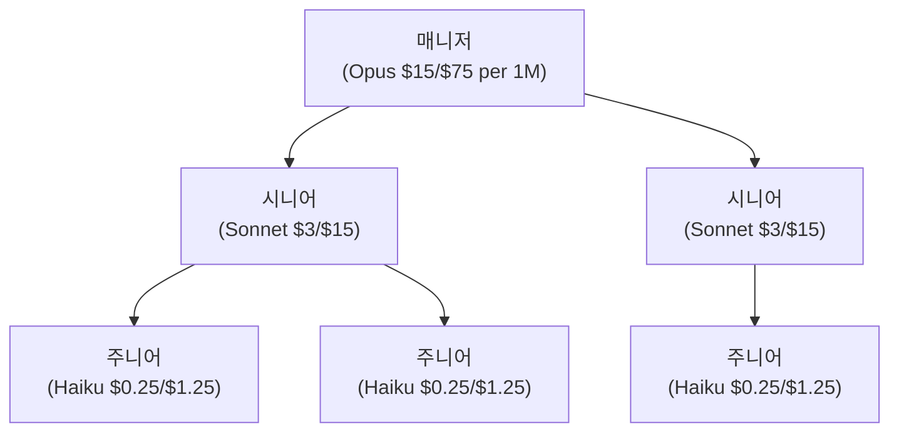

## Opus 5개를 동시에 돌렸더니 월 청구서가 왔다

멀티에이전트 시스템을 처음 돌려본 건 블로그 콘텐츠 파이프라인이었다. 리서치, 초안 작성, AI slop 검수, 이미지 생성, 최종 편집. 5개 단계를 전부 Claude Opus로 돌렸다. 결과는 좋았다. 한 편에 약 45분, 품질도 괜찮았다.

근데 한 달 돌리고 비용을 보니 얘기가 달랐다. Opus 입력 $15/1M 토큰, 출력 $75/1M. 리서치 단계에서만 평균 50K 토큰을 쓰고, 초안 작성에 80K, 검수에 30K. 글 한 편에 토큰 비용만 약 $8~12. 일주일에 3편이면 월 $100~150. 개인 블로그 운영비로는 과하다.

그때 떠오른 게 인간 조직이었다. 어떤 회사도 모든 직원을 시니어 레벨로 채용하지 않는다. 시니어가 해야 할 일과 주니어가 해도 되는 일을 구분해서, 예산 안에서 최대 효율을 뽑는 게 조직 설계다.

에이전트도 마찬가지 아닌가.

## 브룩스 법칙의 AI 버전

에이전트를 늘리면 더 많은 일을 할 수 있을까. 직관적으로는 그렇다. 근데 현실은 좀 다르다.

Google Research와 MIT Media Lab이 180개 에이전트 구성을 테스트한 논문이 있다.[^1] 결과가 꽤 충격적이었다. 독립적으로 동작하는 에이전트들의 에러 증폭률이 17.2배였다. 중앙 조정이 있으면 4.4배로 줄긴 하지만, 여전히 단일 에이전트 대비 에러가 늘어난다. 순차적 추론 작업은 멀티에이전트로 바꾸면 성능이 39~70% 떨어졌다.

세 가지 효과가 동시에 일어나기 때문이다.

첫째, **도구-조정 트레이드오프**. 예산이 정해져 있으면 에이전트에 도구를 더 줄지, 에이전트 간 조정에 예산을 쓸지 선택해야 한다. 둘 다 하면 예산이 터진다.

둘째, **능력 포화**. 단일 에이전트가 이미 45% 이상 성능을 내는 작업에서는 에이전트를 더 투입해도 수확이 급감한다.

셋째, **에러 증폭**. 에이전트 A의 출력이 에이전트 B의 입력이 되면, A의 작은 실수가 B에서 커진다. 체인이 길수록 기하급수적으로 악화된다.

이건 1975년에 Brooks가 말한 것과 본질적으로 같다. "늦어진 프로젝트에 인력을 추가하면 더 늦어진다."[^2] 사람 조직에서는 커뮤니케이션 비용이 n(n-1)/2로 증가하니까. 에이전트 조직에서는 그게 컨텍스트 동기화 비용으로 나타난다. 글로벌 컨텍스트를 에이전트 간 메시지로 압축해서 전달해야 하는데, 이 과정에서 정보가 손실되고 비용이 늘어난다.

그래서 "에이전트를 더 돌리면 되겠지"는 대부분 틀린 답이다.

## 인건비 = 토큰

인간 조직에서 인건비가 조직 구조를 만든다는 건 상식이다. 시니어를 사소한 일에 계속 붙이면 낭비다. 모든 사람이 모든 회의에 참석하면 시간이 폭증한다. 고연봉 매니저가 코드를 직접 짜고 앉아있으면 기회비용이 크다.

에이전트 조직도 예산 구조가 있다. 화폐만 다를 뿐이다.

| 인간 조직의 예산 | 에이전트 조직의 예산 |
|---------------|-----------------|
| 인건비 (연봉) | 토큰 비용 ($/1M) |
| 회의 시간 | 컨텍스트 동기화 토큰 |
| 관리 비용 (매니저) | 오케스트레이터 추론 비용 |
| 출장/교육비 | 외부 도구 호출 비용 |
| 사무실/인프라 | 컴퓨팅 리소스 |

이 매핑이 중요한 이유는, 인간 조직 설계에서 이미 검증된 원칙들이 에이전트 조직에도 거의 그대로 적용되기 때문이다.

예를 들어 인간 조직에서 "고연봉 시니어를 반복 작업에 쓰지 마라"는 원칙이 있다. 에이전트 세계에서는 "Opus급 모델을 포맷 변환이나 린트 수정에 쓰지 마라"가 된다. "모든 사람이 전체 회의에 참석하면 안 된다"는 "모든 에이전트에 전체 레포 컨텍스트를 넣으면 안 된다"가 된다.

## 주니어, 시니어, 매니저

사람 조직의 직급을 에이전트에 그대로 옮기면 이상하지만, 역할의 본질로 번역하면 꽤 잘 맞는다.

**주니어 에이전트** (Haiku급). 좁고 명확한 작업 전용이다. 입출력 포맷이 강하게 정해져 있고, 로컬 컨텍스트만 본다. 검토 없이 바로 merge하면 안 된다. 테스트 코드 생성, 타입 에러 수정, 문서 포맷 정리, 로그 분류 같은 일을 맡는다. 판단보다 실행 담당이다.

**시니어 에이전트** (Sonnet급). 모호한 요구를 작업 단위로 분해한다. 여러 선택지를 비교하고 아키텍처, 품질, 장기 영향을 고려한다. 하위 에이전트 산출물을 리뷰하고 수정 방향을 제시한다. 신규 기능 구조 제안, 리팩토링 범위 설계, 성능 트레이드오프 검토 같은 일을 한다. 로컬 최적화가 아니라 시스템 관점의 판단을 하는 역할이다.

**매니저 에이전트** (Opus급). 직접 코드를 제일 잘 짜는 존재일 필요가 없다. 어떤 일을 누구에게 보낼지, 어떤 컨텍스트를 누구에게 줄지 정한다. 예산을 관리하고 병목을 제거한다. 좋은 리더보다 좋은 스케줄러에 가깝다.

Anthropic의 멀티에이전트 리서치 시스템이 정확히 이 구조다. Opus가 리드 에이전트로 쿼리를 분해하고, Sonnet 서브에이전트들이 병렬로 탐색한다. 이 조합이 단일 Opus보다 리서치 태스크에서 90.2% 더 나은 결과를 냈다.[^3] 근데 토큰은 약 15배를 썼다. 성능과 비용 사이에 트레이드오프가 있다.

이 구조에서 핵심은 **어떤 판단에 얼마짜리 모델을 쓸 것인가**다. 포맷 변환에 Opus를 쓰면 돈을 태우는 거고, 아키텍처 결정에 Haiku를 쓰면 품질을 태우는 거다.

## 컨텍스트 예산 배분

토큰 비용만큼 중요한 게 컨텍스트 배분이다. 인간 조직에서 need-to-know 원칙이 있듯이, 에이전트도 역할에 따라 볼 수 있는 정보를 달리해야 한다.

내가 쓰는 4계층 모델은 이렇다.

**헌법층**. 절대 규칙이다. 보안 원칙, 코딩 컨벤션, 금지사항, 승인 정책. 모든 에이전트가 본다. 양은 적지만 무게는 크다.

**프로젝트층**. 비교적 안정적인 맥락이다. 아키텍처, 도메인 개념, 폴더 구조, 팀 규칙. 매니저와 시니어가 주로 보고, 주니어는 관련된 부분만 발췌해서 받는다.

**스프린트층**. 현재 목표다. 이번 주 우선순위, 진행 중 이슈, 알려진 위험. 매니저가 관리하고 시니어에게 전달한다.

**작업층**. 지금 이 작업의 입출력이다. 목표, 참조 파일, 체크리스트. 주니어 에이전트는 이것만 봐도 된다.

이렇게 나누면 주니어 에이전트에 전체 레포 컨텍스트를 때려넣을 필요가 없다. 헌법층 + 작업층만 주면 된다. 토큰도 아끼고, 더 중요한 건 불필요한 정보로 인한 혼란도 줄어든다.

솔직히 이 계층화가 항상 깔끔하게 되지는 않는다. 프로젝트층과 스프린트층의 경계가 모호할 때가 있고, 어떤 정보를 어느 층에 넣을지 매번 고민이 된다. 근데 아예 안 나누는 것보다는 대충이라도 나누는 게 낫다. "전부 다 준다" vs "필요한 만큼만 준다"의 차이가 비용에서 체감된다.

## 에이전트 조직의 KPI

인간 조직도 "많이 만드는 팀"이 좋은 팀이 아니듯, 에이전트 조직도 생산량이 KPI가 아니다. 한정된 예산 안에서 얼마나 안정적으로 신뢰할 수 있는 결과를 내느냐가 진짜 지표다.

내가 추적하는 건 이런 것들이다.

작업당 총 토큰 비용. 이게 계속 올라가면 뭔가 잘못되고 있다는 신호다. 대개 컨텍스트가 불필요하게 비대해졌거나, 재시도가 많거나, 티어링이 안 되고 있다.

재시도율. 한 번에 통과하는 작업의 비율. 이게 낮으면 명세가 부실하거나 에이전트 역할 분리가 안 되어 있다.

인간 개입 빈도. 자동으로 흘러가야 할 단계에서 사람이 끼어드는 횟수. 이게 높으면 에이전트 권한이나 판단 기준이 부족하다는 뜻이다.

동일 실수 반복률. 같은 에러가 반복되면 기억 시스템(결정 로그, 정책 업데이트)이 작동하지 않는 거다.

이건 사실 인간 팀의 velocity, defect rate, rework rate와 본질적으로 같다. 다만 에이전트 세계에서는 모든 행위가 로그로 남으니까 측정이 더 정확하게 된다. 인간 팀에서 "체감상 느려졌어"인 걸 에이전트 팀에서는 "작업당 토큰이 지난 주 대비 23% 증가"로 찍을 수 있다는 점에서 오히려 관리가 쉬울 수도 있다.

## 결국 조직 설계다

에이전트를 더 돌리면 생산성이 올라간다는 건 "사람을 더 뽑으면 빨라진다"만큼이나 순진한 생각이다. 180개 구성을 테스트한 논문이 그 증거고, 내 경험도 같은 방향을 가리킨다.

진짜 질문은 "에이전트 몇 개를 쓸까"가 아니라 "제한된 토큰 예산 안에서 어떻게 역할을 나누고, 컨텍스트를 배분하고, 검증 루프를 돌릴까"다.

이건 프롬프트 엔지니어링이 아니다. 조직 설계다. 다만 인건비 대신 토큰이, 회의 대신 컨텍스트 동기화가, 1:1 미팅 대신 상태 파일이 있는 조직 설계.

[^1]: "Towards a Science of Scaling Agent Systems" (arXiv:2512.08296, 2025). Google Research + MIT Media Lab. 180개 에이전트 구성 테스트, 독립 에이전트 에러 증폭 17.2배, 중앙 조정 시 4.4배.
[^2]: Brooks, *The Mythical Man-Month* (1975). "Adding manpower to a late software project makes it later." 커뮤니케이션 비용 n(n-1)/2 공식.
[^3]: [Anthropic: How We Built Our Multi-Agent Research System](https://www.anthropic.com/engineering/multi-agent-research-system) (2025). Opus lead + Sonnet subagents 조합이 단일 Opus 대비 90.2% 향상, 토큰 사용량 약 15배.
