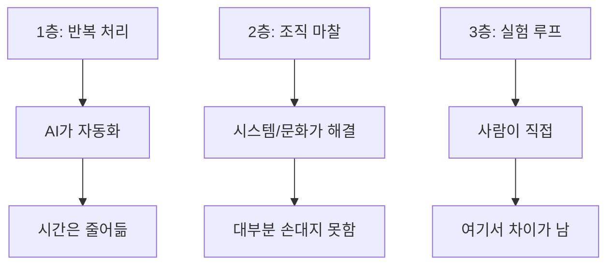

## 바쁜데 남는 게 없다

하루가 끝나면 피곤하다. 회의 6개, 슬랙 200개, 메일 30개. 분명히 쉬지 않았는데 "오늘 뭐 했지?" 하면 딱히 떠오르는 게 없다. 할 일 목록은 아침이랑 똑같다.

이상한 거다. 8시간을 일했는데 진짜 내 일은 언제 한 건가?

Microsoft의 Work Trend Index 데이터가 이걸 숫자로 보여준다. 평균적인 지식노동자는 업무 시간의 57%를 커뮤니케이션(회의, 이메일, 채팅)에 쓰고, 실제 무언가를 만드는 데는 43%만 쓴다.[^1] Asana의 분석은 더 심하다. 업무 시간의 60%가 "work about work", 그러니까 일에 대한 일에 쓰인다.[^2] 정보 찾기, 앱 전환, 상태 확인, 회의 일정 조율, 결정 추적. 일 자체가 아니라 일을 하기 위한 준비와 조율에 하루의 절반 이상이 사라진다.

주당 11.3시간이 회의다. 그중 연간 103시간, 그러니까 13일치가 당사자도 불필요하다고 느끼는 회의다.[^3] 인터럽트 후 집중을 되찾는 데 걸리는 시간은 23분 15초.[^4] 하루에 앱을 1,200번 전환한다.[^5]

이 숫자들을 보면 결론이 하나 나온다. 당신이 바쁜 이유는 일이 많아서가 아니라, 일이 아닌 것이 너무 많아서다.

## 세 가지를 섞어 부르고 있다

"일이 어렵다"고 할 때 사람들은 보통 세 가지를 한 덩어리로 뭉갠다.

하나는 **행위 구조의 복잡함**이다. 실제로 뭘 하느냐의 구조. 마케터를 예로 들면 가설을 세우고, 소재를 만들고, 집행하고, 수치를 보고, 비교하고, 수정하고, 반복한다. 채용도 비슷하다. 필요한 인재를 정의하고, 후보를 모으고, 기준에 따라 보고, 비교하고, 대화하고, 결정한다. 구조만 보면 생각보다 단순한 반복 루프인 경우가 많다.

다른 하나는 **목적 달성의 어려움**이다. 루프를 돌린다고 원하는 결과가 나오는 건 아니다. 시장은 불확실하고, 경쟁이 있고, 타이밍이 맞아야 하고, 운도 필요하다. 마케팅 캠페인의 전환율을 올리는 건 어렵다. 좋은 인재를 찾는 것도 어렵다. 근데 이건 행위가 복잡해서 어려운 게 아니라, 결과가 불확실해서 어려운 거다.

마지막은 **조직 마찰**이다. 보고, 조율, 정치, 책임, 우선순위 충돌, 컨텍스트 전환, 감정 노동. 이게 실제로 사람을 갈아넣는다.

현실에서는 이 셋이 한꺼번에 느껴진다. 그래서 체감상 "이 일은 엄청 복잡하다"가 된다. 근데 뜯어보면 대부분의 에너지는 세 번째, 조직 마찰에서 소진된다.

## 운동선수는 왜 힘든가

이 구분이 왜 중요한지 운동선수로 생각해보면 바로 감이 온다.

프로 운동선수의 코어 루프는 극단적으로 단순하다. 훈련하고, 측정하고, 수정하고, 반복하고, 실전에서 실행한다. 이보다 단순할 수 없다.

근데 운동은 어렵다. 왜? 행위가 복잡해서가 아니다. 같은 루프를 수천 번 돌려도 1등과 2등이 갈리는 건 재능, 누적 시간, 피드백 품질, 경쟁 강도, 멘탈 유지 같은 것들 때문이다. 구조의 복잡함이 아니라 목적 달성의 어려움이다.

체스도 그렇다. 규칙은 30분이면 배운다. 근데 그랜드마스터가 되는 건 평생이 걸린다. 글쓰기도 그렇다. 쓰고, 고치고, 다시 쓰고. 루프는 단순한데 좋은 글을 쓰는 건 어렵다.

**구조가 단순하다는 말이 쉽다는 뜻은 아니다.** 이 둘을 섞으면 안 된다.

## 채용이라는 일을 분해해보면

더 현실적인 예를 하나 들어보자. 채용.

"채용은 너무 불확실하고, 사람을 상대해야 하고, 복잡해!" 이렇게 말하는 사람이 많다. 근데 업무 자체만 보면 어떤가?

필요한 사람을 정의한다. 후보를 모은다. 기준에 따라 본다. 비교한다. 대화한다. 결정한다. 안 되면 반복한다.

이게 끝이다. 구조만 보면 이보다 단순한 일이 없다.

채용이 힘든 건 다른 데서 온다. 채용 담당자(hiring manager)가 원하는 사람이 자꾸 바뀐다. JD는 추상적이다. 평가 기준이 면접관마다 다르다. 정치가 개입된다. 예산 문제가 생긴다. 후보자 마음도 변한다. 막판에 대표가 뒤집는다.

이건 전부 조직 마찰이다. 채용이라는 행위의 코어가 복잡해서가 아니다.

그리고 사람들이 "감"이라고 부르는 것도 상당 부분은 구조화가 안 된 판단이다. "이 회사 출신은 좀 다르지" 같은 건 영원한 진리가 아니라 검증 안 된 가설에 가깝다. 입사 후 퍼포먼스라는 현실 피드백을 통해 계속 깨지고 수정돼야 하는 것이다. 코어가 아니라 측정과 조정의 대상이다.

<!-- TODO: Drake 밈 추가 (회의에서 채용 논의 vs 회의 끝나고 실제 이력서 보기) -->

## 에러 핸들러로 산다는 것

이쯤 되면 좀 무서운 해석이 가능해진다.

많은 화이트칼라 업무는 "고도의 지적 노동"이라기보다, **낮은 품질의 운영 시스템을 인간이 몸으로 메우는 노동**일 수 있다.

프로그래밍에서 에러 핸들러(try-catch)는 시스템이 예상 못한 상황을 처리하는 코드다. 잘 만든 시스템은 에러 핸들러가 거의 안 돌아간다. 못 만든 시스템은 에러 핸들러가 주요 실행 경로가 된다.

조직도 비슷하다. 프로세스가 명확하고, 기준이 공유되고, 정보가 제때 흐르면 사람이 메울 일이 적다. 반대로 프로세스가 애매하고, 기준이 사람마다 다르고, 정보가 흩어져 있으면 사람이 계속 끼어들어야 한다. 누락을 체크하고, 맥락을 다시 설명하고, 애매한 결과물을 정리하고, 남이 안 한 일을 찾아서 한다.

그래서 사람들이 "일이 너무 힘들다"고 할 때 원인은 꼭 업무 난이도가 아닐 수 있다. 오히려 더 큰 비중은 컨텍스트 전환, 모호한 지시, 책임 불균형, 우선순위 충돌에서 나온다.

극단적으로 말하면 어떤 사람의 하루는 실제 본업 2시간, 나머지 6시간은 본업을 하기 위해 발생한 조직적 오버헤드일 수도 있다. 60%라는 숫자가 그 증거다.

이건 그 사람을 깎아내리는 말이 아니다. 반대로, 더 현실적인 존중이다. "너는 별로 안 좋은 시스템 속에서 많은 마찰을 견디며 결과를 내고 있었네." 이건 "네 일은 쉬워"와 완전히 다른 문장이다.

## 그래서 AI는 어디를 먹는가

이 구분이 AI 시대에 특히 중요해지는 이유가 있다.

사람들은 "AI가 내 업무를 대신해주면 엄청난 성과가 나겠지"라고 기대한다. 근데 3층 구조로 보면 AI가 잘하는 건 1층(반복 처리)이다. 정리, 분류, 비교, 초안, 요약, 상태 업데이트. 이건 이미 Claude Code나 ChatGPT로 상당 부분 가능하다.

문제는 1층을 자동화해도 2층(조직 마찰)은 그대로라는 거다. 회의는 여전히 많고, 우선순위는 여전히 충돌하고, 기준은 여전히 사람마다 다르다. AI가 초안을 3분 만에 만들어줘도, 그 초안을 두고 3명이 2시간 회의하면 결국 같다.

그리고 진짜 차이를 만드는 3층(실험 루프)은 AI가 대체하지 않는다. 무엇을 실험할지, 어떤 지표를 볼지, 결과를 어떻게 해석할지, 기준을 언제 바꿀지. 이건 여전히 사람의 몫이다.

그래서 냉정하게 보면 이렇다. AI가 당신의 반복 업무를 전부 자동화해줘도 당신의 위치는 크게 안 바뀔 수 있다. 원래 차이를 만든 건 반복 처리 속도가 아니라, 좋은 가설을 세우고 실험을 설계하는 능력이었으니까.

## 당신은 어느 층에서 살고 있나

이 글을 읽고 있는 당신의 하루를 떠올려보면 어떤가.

오늘 한 일 중에 1층(반복 처리)은 몇 퍼센트였나. 2층(조직 마찰)은? 3층(가설, 실험, 해석)은?

대부분의 사람은 2층에서 하루를 태우고 있을 거다. 그리고 그걸 "일이 어렵다"고 부르고 있을 거다.

솔직히 이게 개인의 문제만은 아니다. 조직이 마찰을 방치하고, 시스템 대신 사람에게 에러 핸들링을 떠넘기는 구조가 문제다. 근데 최소한 이 구분을 알면 질문이 바뀐다. "일이 왜 이렇게 어려워?"에서 "지금 나를 지치게 하는 게 진짜 일인가, 아니면 일 주변의 마찰인가?"로.

이 질문 하나만으로도 하루가 조금 달라질 수 있다. 아닐 수도 있고. 솔직히 모르겠다. 근데 적어도 "바쁜데 남는 게 없는" 이유는 좀 더 선명해질 거다.

[^1]: [Microsoft — Work Trend Index: Breaking Down the Infinite Workday](https://www.microsoft.com/en-us/worklab/work-trend-index/breaking-down-infinite-workday)
[^2]: [Breeze PM — Workplace Productivity Statistics 2026](https://www.breeze.pm/articles/workplace-productivity-statistics)
[^3]: [Speakwise — Meeting Overload Statistics 2026](https://speakwiseapp.com/blog/meeting-overload-statistics)
[^4]: [Speakwise — Context Switching Statistics 2026](https://speakwiseapp.com/blog/context-switching-statistics)
[^5]: [Harvard Business Review — Digital Workers Toggle 1,200 Times Per Day](https://hbr.org/2022/08/how-much-time-and-energy-do-we-waste-toggling-between-applications)
